# The Triple Lindy

*Solution Guide*

## Overview

In *The Triple Lindy*, teams perform a penetration test against a local swimming pool. Players will use the provided Kali machine to gather data and exploit websites and SCADA/ICS systems to ensure the pool's safe operation.

There are four (4) tokens to retrieve in this challenge. All tokens will be available in the Townsville Pool website as they are unlocked by completing the steps below.

*The Triple Lindy* is an infinity-style challenge. The tokens you see in this solution guide will have different values but will use the same format.

For your convenience, we've repeated some of the challenge instructions here in the challenge solution guide.

Start by logging into the `kali` VM, then browse to `http://townsville-pool.pccc` to gather information about the Townsville Pool's technical operations. `ctmodbus` and `pymodbus` have been installed on the Kali VMs. A DNS server at `dns.pccc` resolves challenge hostnames — use `--dns-servers dns.pccc` with nmap scans.

## Question 1

*What is the value of token 1 that is awarded after logging into the Townsville Pool's website as the pool president?*

1. Open a web browser on your Kali VM and navigate to: `http://townsville-pool.pccc`.

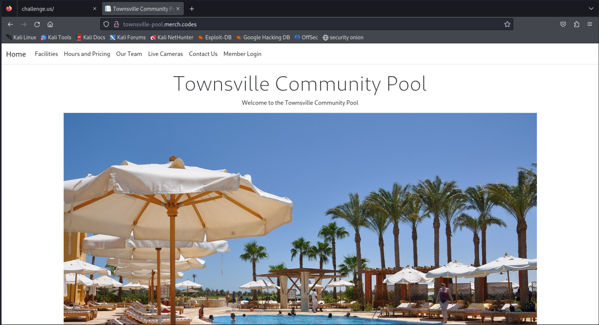

2. Click **Our Team**. Here you will find the email addresses of some of the pool staff, including the pool president.

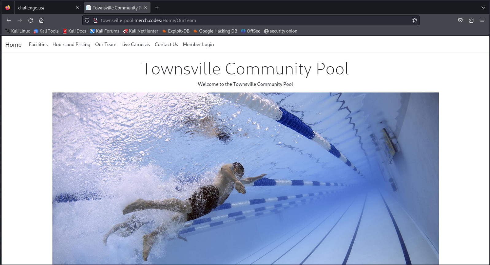

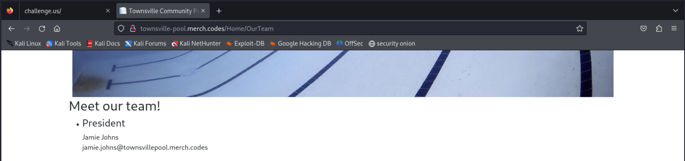

3. The next step is to find the president's password. In a new terminal, run `cewl` to create a list of possible passwords from the website's content:

```bash
cewl -v http://townsville-pool.pccc > passwords.txt
```

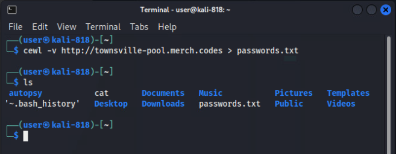

Now that we have a potential list of passwords, we will try brute forcing the login. Examine the login form.

4. On the Townsville Community Pool website, click **Member Login**.

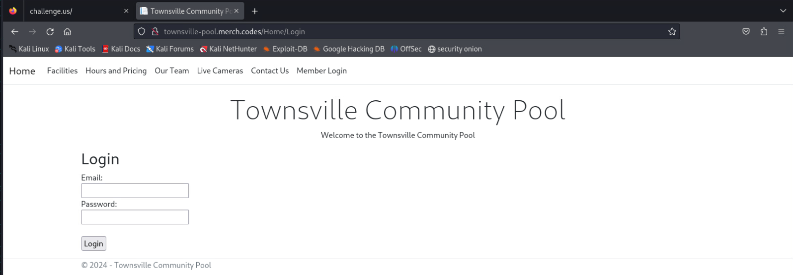

5. Right-click the web page and choose **View Page Source**. You will see the HTML source code for the login page. Scroll down until the HTML `form` element is visible.

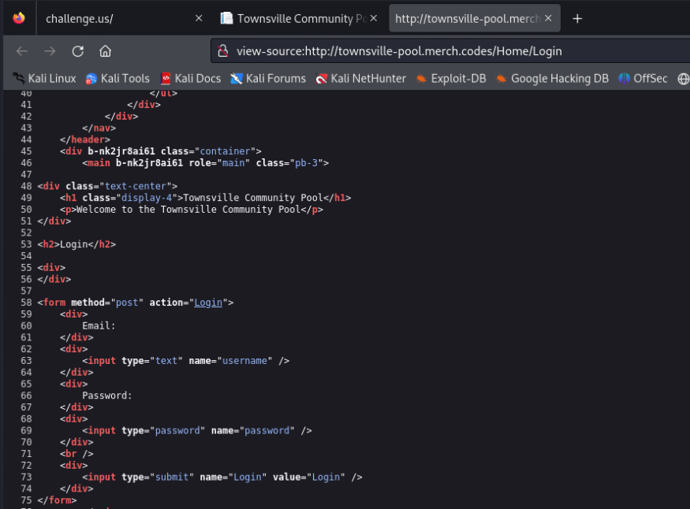

You can see the name of the form elements used to submit the username and password. The form element name properties are `username` and `password`. We will use these with `hydra` to brute force the page.

6. We need to supply to `hydra` with the text returned for an invalid login attempt. On the form, enter an invalid email and password and click **Login**. A message states: `Invalid email or password.`

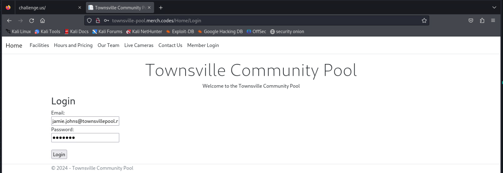

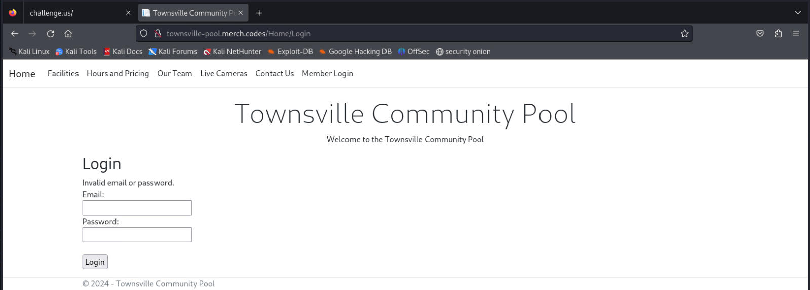

7. Using the information gathered in the steps above, run the command below to brute force the login.

```bash
sudo hydra -l jamie.johns@townsvillepool.pccc -P /home/user/passwords.txt townsville-pool.pccc http-post-form "/Home/Login:username=^USER^&password=^PASS^:Invalid email or password"
```

8. Review the successful password recovery result below.

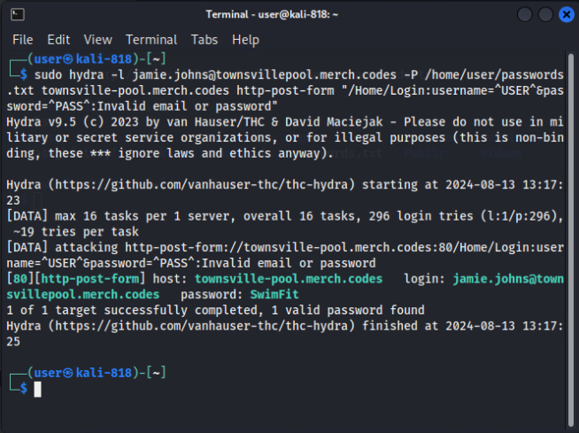

9. Log into the pool website with the following credentials:

- Email Address: `jamie.johns@townsvillepool.pccc`
- Password: `Hydrotherapy` (*Remember, the password is randomly selected upon challenge deployment. Your password will likely be different each time you launch this challenge.*)

Upon successful login with the pool president's credentials, Token 1 is displayed.

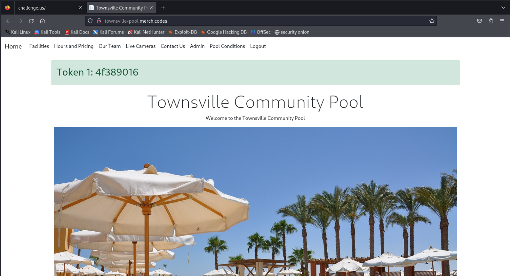

The correct submission for Question 1 is: `PCCC{login_Satisfied}`. Recall, this is an infinity-style question and the token will vary for your challenge instance.

## Question 2

*What is the value of token 2, which is awarded after you raise the temperature of the pool to 110 degrees Fahrenheit?*

1. Browse to `http://townsville-pool.pccc`. You may still have it open from solving Question 1.

2. Login as the pool president using the steps from Question 1. Notice the **Admin** link in the navigation bar. Click **Admin**.

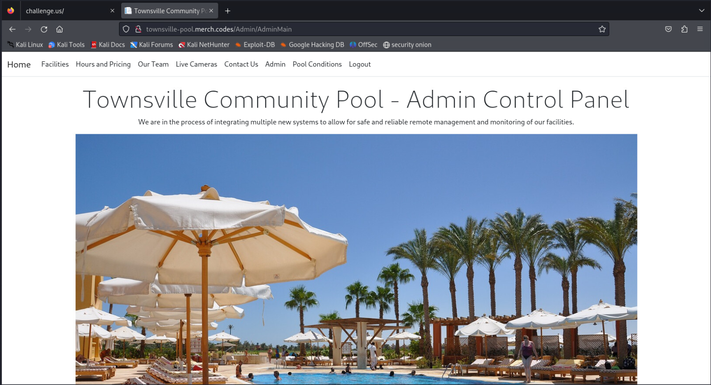

3. The Admin Control Panel is where administrators raise or lower the pool temperature, but the system is limited to the range of *X to X* by the user interface control. This web page is set to auto-refresh every 60 seconds. As a result, you may see a popup window with a message similar to the following: "To display this page, Firefox must send information that will repeat any action (such as a search or order confirmation) that was performed earlier." It is safe to click the **Cancel** button.

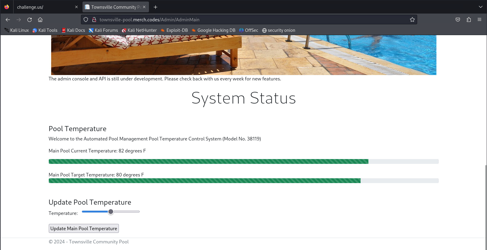

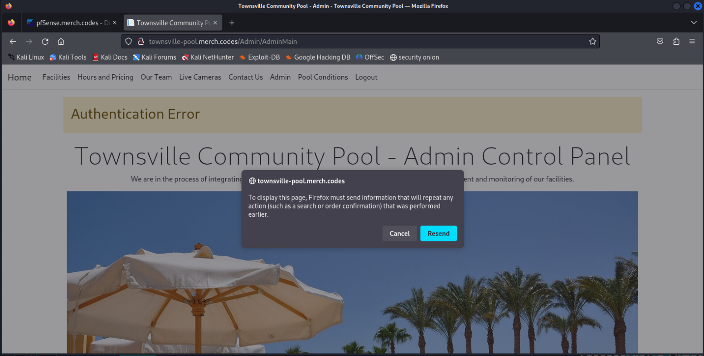

4. Open the web browser's developer tools and click the **Network** tab.

5. Use the slider to update the pool temperature, then click **Update Main Pool Temperature**.

6. Notice the `Authentication Error` message displayed at the top of the page. Additionally, in the **Network** tab in developer tools, a new `POST` message was added *after* you submitted the form. Right-click that message and choose **Edit and Resend** to see the details of the previous form post.

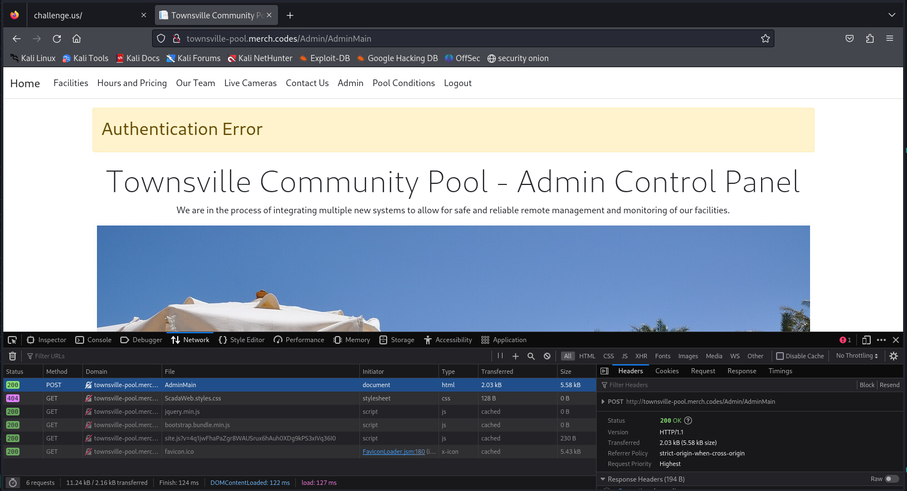

7. Scroll in the POST details to see the form `Body` contents.

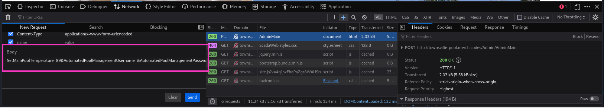

You should see something similar to the following content:

```text
SetMainPoolTemperature=89&AutomatedPoolManagementUsername=&AutomatedPoolManagementPassword=&Submit=Update+Main+Pool+Temperature
```

8. Notice that there are no values for the `AutomatedPoolManagementUsername` and `AutomatedPoolManagementPassword` form elements that were submitted. We need to find these values before we can POST a successful temperature update. Keep this browser tab open.

9. We already know from the challenge instructions that third-party websites can be found on the network. Let's start with an `nmap` scan.

```bash
nmap --dns-servers dns.pccc -sn $(ip route | grep "eth0" | grep -v default | awk '{print $1}')
```

The results show a website with a hostname that resolves to `apm.pccc`.

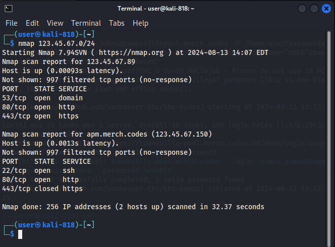

10. Browse to `http://apm.pccc`. You have located the website of the Automated Pool Management Corporation.

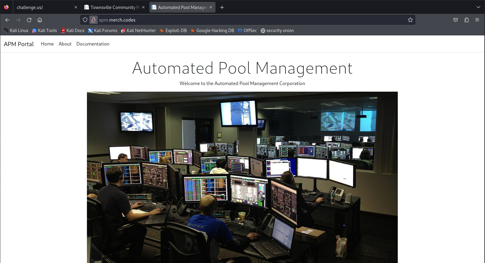

11. Browse the website. The **Home** and **About** pages don't provide any useful information, but the **Documentation** page contains a search form. Keep this website open for now.

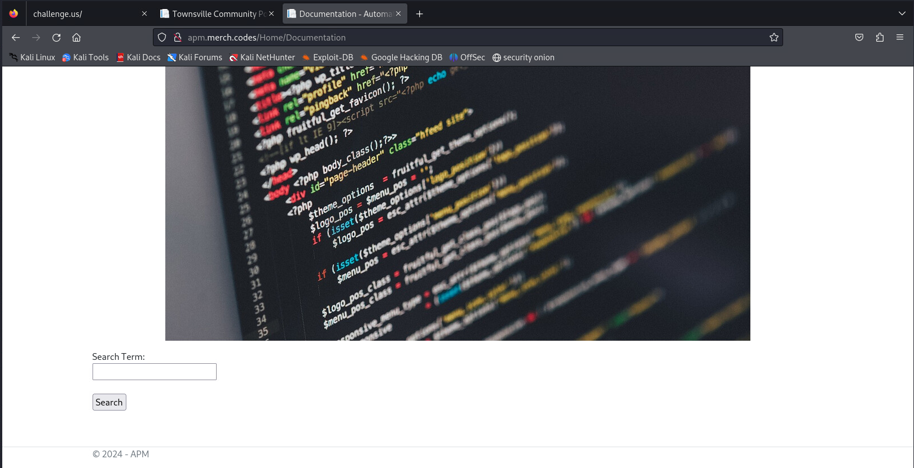

12. Return to the pool website at `http://townsville-pool.pccc`. Click **Facilities**. In the list of facilities and future projects note the **Poolside_Innovations** project text:

> Poolside_Innovations
>
> We are adding advanced new technology throughout the pool grounds to enhance almost every aspect of your experience. We are currently working with a vendor named Automated Pool Management to install their Thermo Control System, Model No. 38119. This system will allow us to remotely monitor and control the temperature of all pools at our facility.

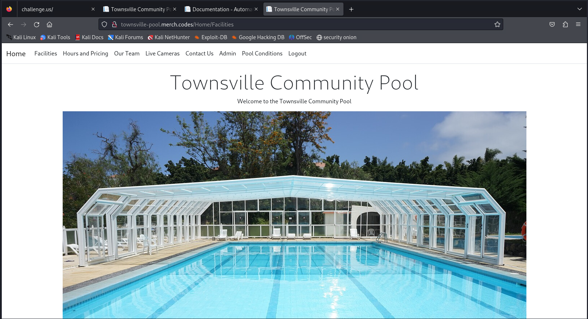

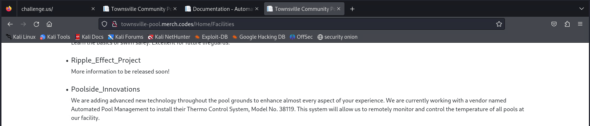

13. The project description mentions Automated Pool Management and a Thermo Control System with a model number of 38119. Go back to the Automated Pool Management website and search for **38119**. You will find one result, the *Model 38119 Thermo Control Quick Start Guide*.

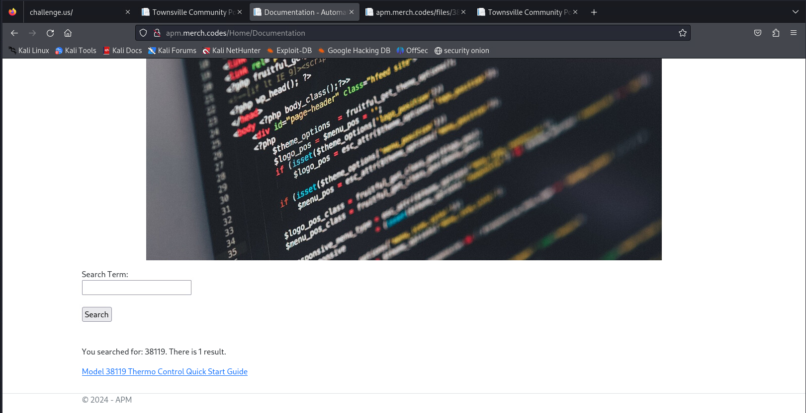

14. Click the **Quick Start Guide** link. In the guide (38119.txt), note the Default Factory Control Credentials.

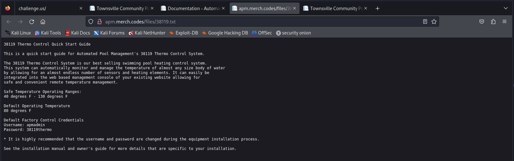

15. We will use these values to POST the form data to change the pool's temperature. Go back to the browser tab with the Admin Control Panel and the open developer tools.

16. We know from the challenge instructions that we must raise the temperature to at least 110 degrees. Modify the POST request **Body** to look like this:

```text
SetMainPoolTemperature=110&AutomatedPoolManagementUsername=apmadmin&AutomatedPoolManagementPassword=38119thermo&Submit=Update+Main+Pool+Temperature
```

17. Click **Send** to post the modified form data.

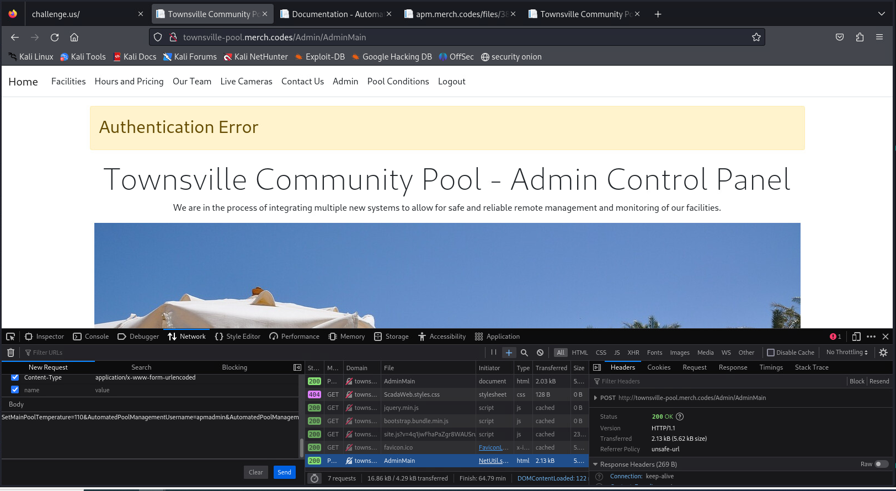

18. At the bottom of the network traffic, select the most recent `POST`. Then select the **Response** tab, scroll through the content, and see Token 2!

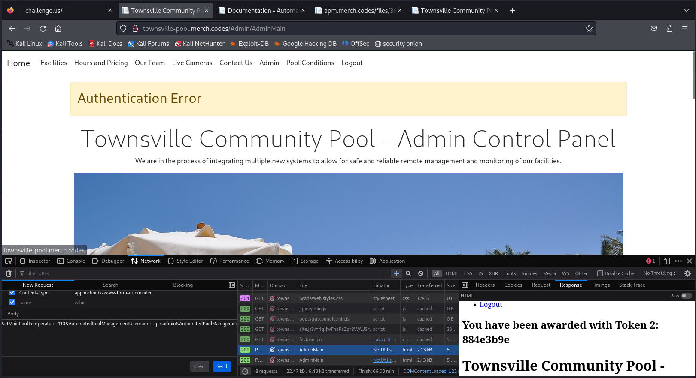

Alternatively, double-click the latest `POST`. A new tab opens containing Token 2.

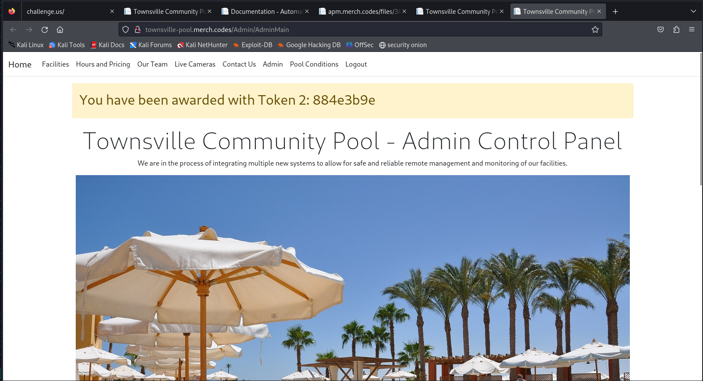

The correct submission for Question 2 is: `PCCC{temp_Satisfied}`. Recall, this is an infinity-style question and the token will vary for your challenge instance.

## Question 3

*What is the value of token 3, which is awarded after you disable the security cameras on the pool website?*

1. Browse to `http://townsville-pool.pccc`. You may still have it open from solving Question 1 and Question 2. It does not matter if you are logged into the web site to complete this question.

2. Click **Live Cameras** to view the cameras. Here you see five pictures.

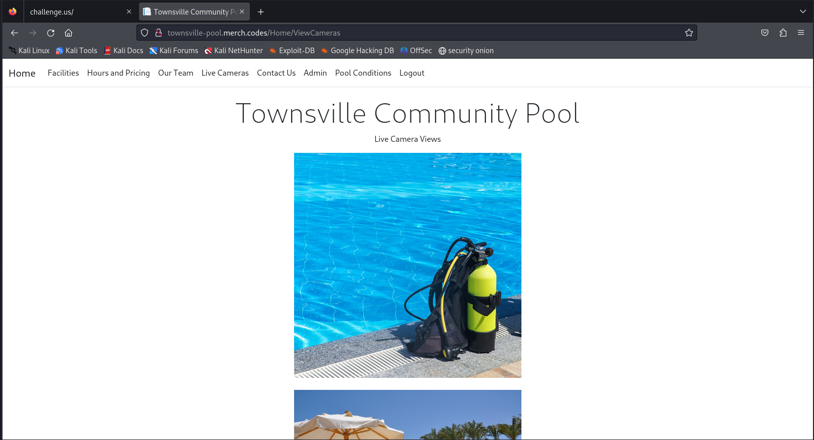

3. Open the browser developer tools, select the **Network**  tab, then refresh the page. Note the five `GET` requests to `secapi.pccc`.

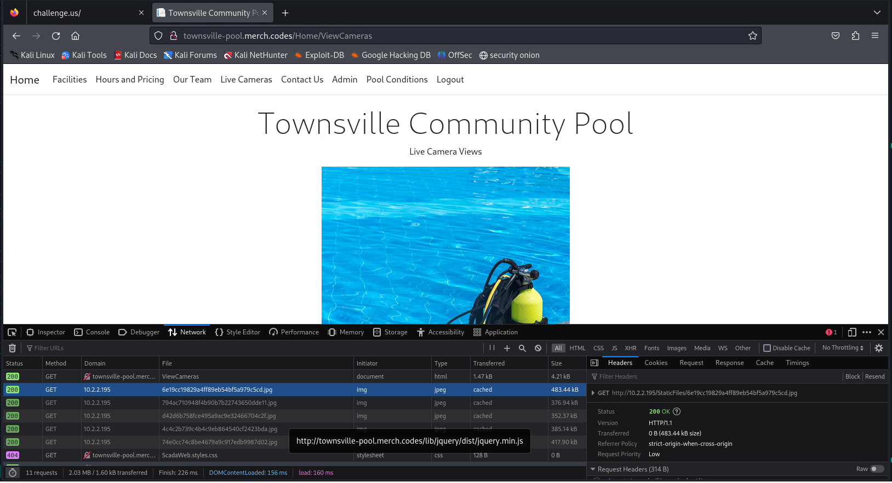

4. In a new browser tab, navigate to `http://secapi.pccc`. You are greeted with a Swagger API documentation page. Here you can interact with the API.

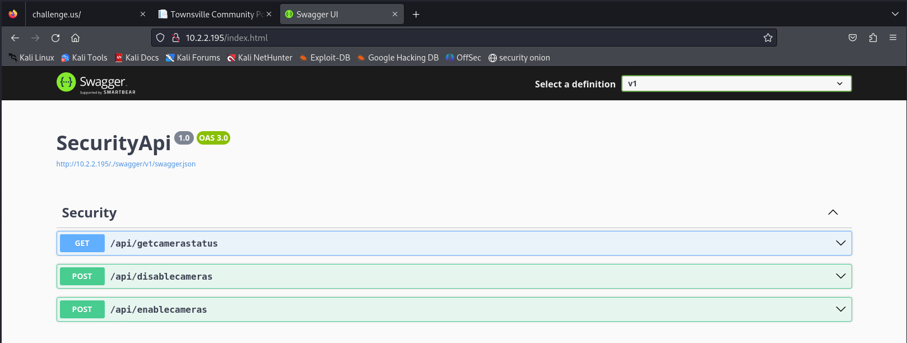

5. One of the APIs is called `disablecameras`. Expand the details for this API call.

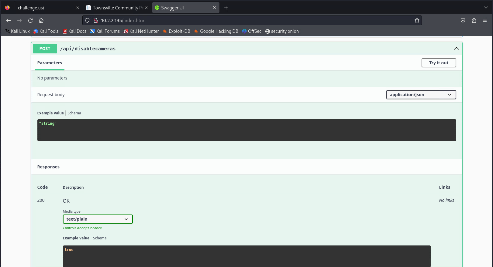

6. Click **Try it out**. The body expects some type of string value. It isn't clear *what* value is expected and the API is poorly documented. 

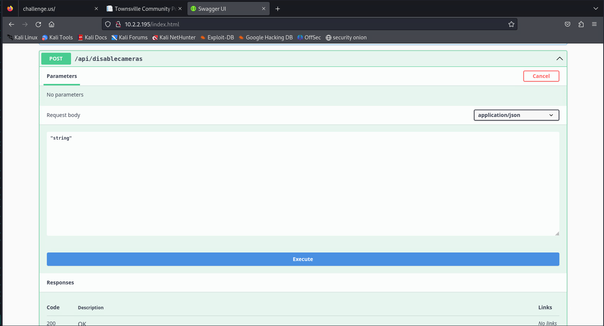

7. Clear the `"string"` value and click **Execute**.

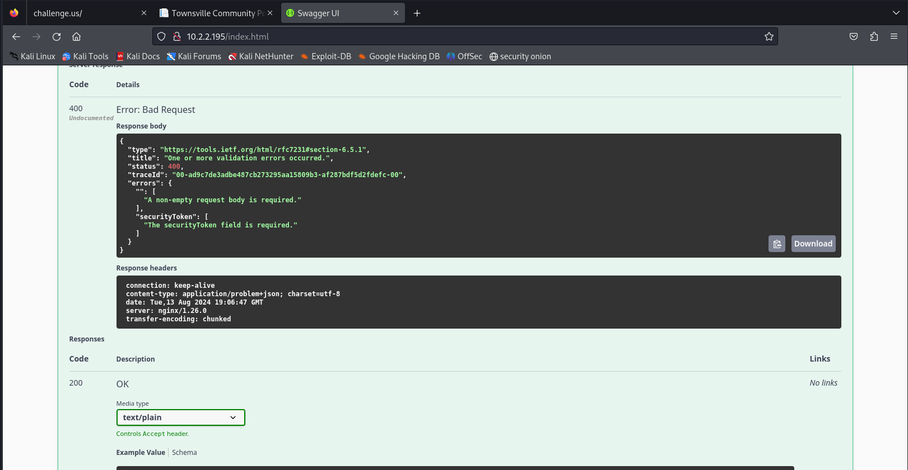

The error message states: `"The securityToken field is required."` to POST to this API method. We haven't seen any traffic that contains a `securityToken` value so it's time to take a packet capture.

8. Open a terminal on your Kali VM and start a packet capture using `tcpdump`:

```bash
sudo tcpdump -i eth0 -w capture.pcap
```

9. While `tcpdump` is running, go back to the Live Cameras page and refresh the page. Then stop the capture with `Ctrl+C`.

10. Open the capture file in Wireshark:

```bash
wireshark capture.pcap
```

11. Filter by `http`. You should see an HTTP request that contains a `SecurityToken` query string value. Select this record and copy the value associated with the `SecurityToken`. Your output may be different, or you may have to inspect packets further. 
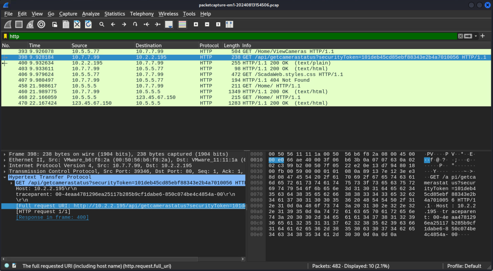

An alternative to this is running:

```bash
sudo tcpdump -r capture.pcap -A | grep -i securityToken
```

12. Go back to the Swagger API at `http://secapi.pccc`. Enter the `SecurityToken` value into the form for the `disablecameras` API. Swagger will automatically format it as JSON, so enter the value without surrounding quotes.

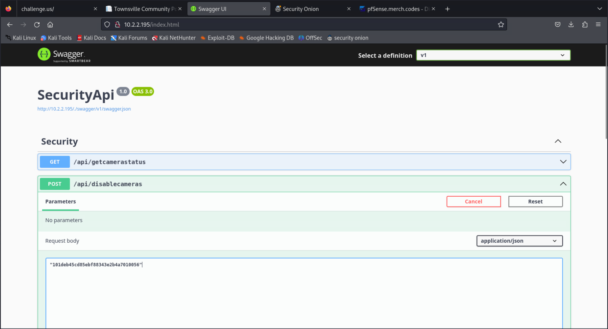

13. Click **Execute**. Clicking Execute should produce an HTTP 200 success message with a return value of `true`.

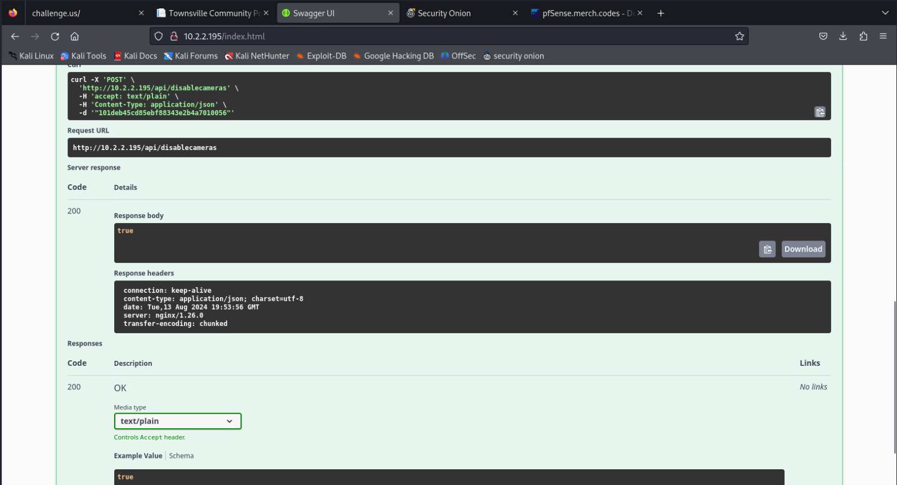

14. Go back to the Live Cameras page and refresh. If you successfully disabled the cameras, the pictures should not be visible, and Token 3 is shown.

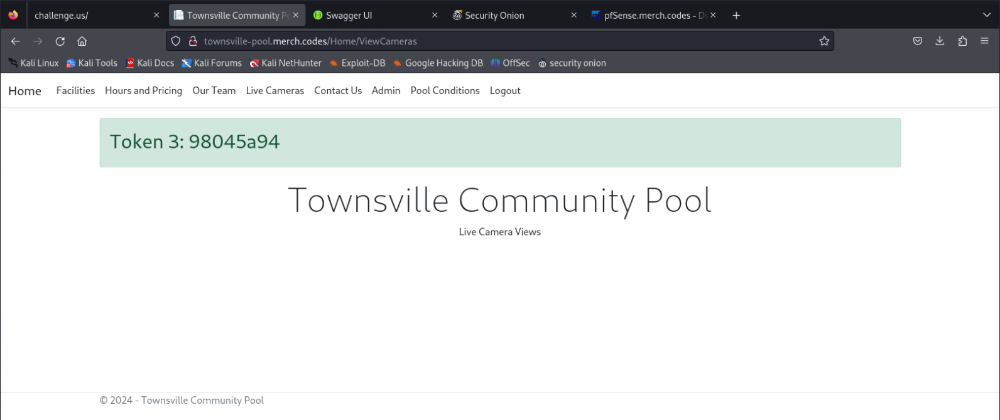

The correct submission for Question 3 is: `PCCC{camera_Satisfied}`. Recall, this is an infinity-style question and the token will vary for your challenge instance.

## Question 4

*What is the value of token 4, which is awarded after you change the pH, chlorine and total alkalinity values?*

1. Browse to `http://townsville-pool.pccc`. You may still have it open from solving the previous questions.

2. While logged in as the pool president, click **Pool Conditions**. The Pool Chemical Balancing System page shows various readings from the pool chemical balances. You are tasked with changing three water balance values:
   - Decrease the pH from 7.0 to 6.0
   - Increase the chlorine level from 3 ppm to 4 ppm
   - Decrease the total alkalinity from 100 ppm to 70 ppm

3. The Pool Conditions page is displaying real-time data from somewhere. Right-click the page and choose **View Page Source**. In the HTML source, you will find a comment left by the developers that reveals the SCADA data source — a Modbus server at `modbus.pccc` on port `502`, along with the holding register addresses used for pool chemical data.

4. We can get the Modbus server's IP address by running:

```bash
ping modbus.pccc
```

5. Double-click the **ctmodbus** shortcut on the Kali VM Desktop (or run `ctmodbus` in a terminal) and connect to the Modbus server using its IP address:

```bash
connect tcp <modbus.pccc-ip>
```

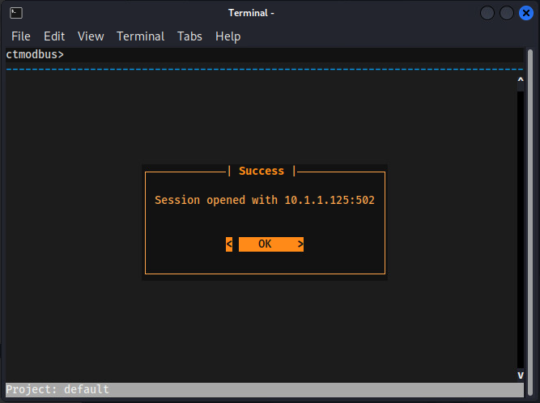

6. The HTML comment told us that three holding registers contain the pool chemical data (HR0=pH, HR1=FAC, HR2=Alkalinity). Read the values in the holding registers. When you read the first three holding register values using the commands below, you will see that the values match the ones you need to change on the Pool Conditions web page.

```bash
read holdingRegisters 0
read holdingRegisters 1
read holdingRegisters 2
```

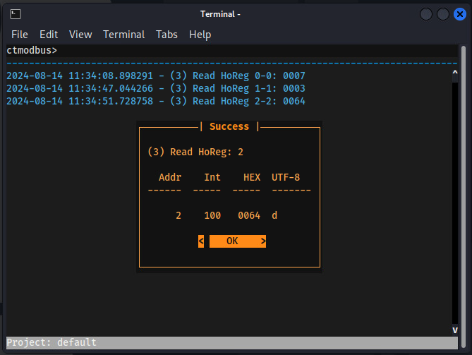

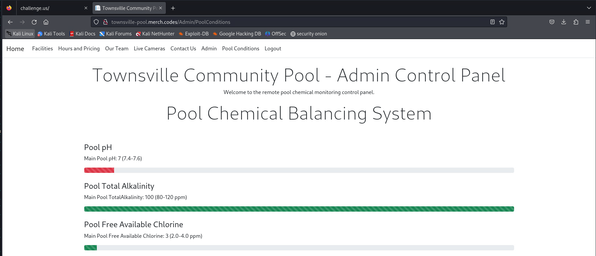

Change these values with these  commands then refresh the Pool Conditions page. Use `ctmodbus` to change the values of the first three holding registers.

```bash
write register 0 6
write register 1 4
write register 2 70
```

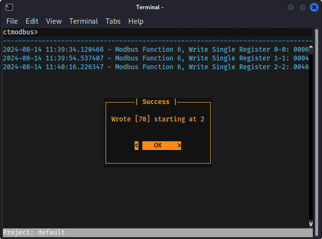

Refresh the `Pool Conditions` page. If you changed the correct values, Token 4 is displayed. Submit this token for Question 4.

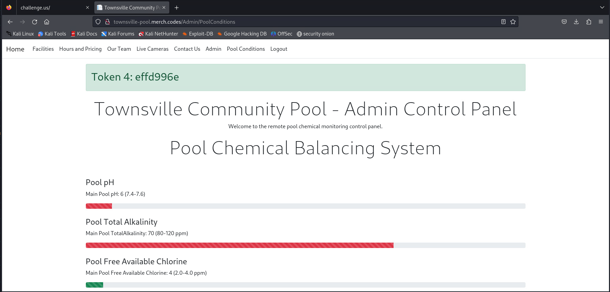

The correct submission for Question 4 is: `PCCC{scada_Satisfied}`. Recall, this is an infinity-style question and the token will vary for your challenge instance.
