# Shop SMart

*Solution Guide*

## Overview

The purpose of this challenge is to attack the S-Mart e-commerce website using [OWASP Top Ten vulnerabilities](https://owasp.org/www-project-top-ten/) to recover four (4) tokens.

Browse to `http://shop-smart`.

## Question 1

*Enter the token received from logging in as an admin user.*

**Vulnerability:** Broken Access Control — the registration form passes `is_admin=0` as a GET parameter that the server trusts without validation.

1. Open Burp Suite and choose the defaults until you come to the Learn tab.

	

2. Select **Proxy**, **Open browser** in the Proxy tab. Browse to `http://shop-smart` in the Burp browser.

	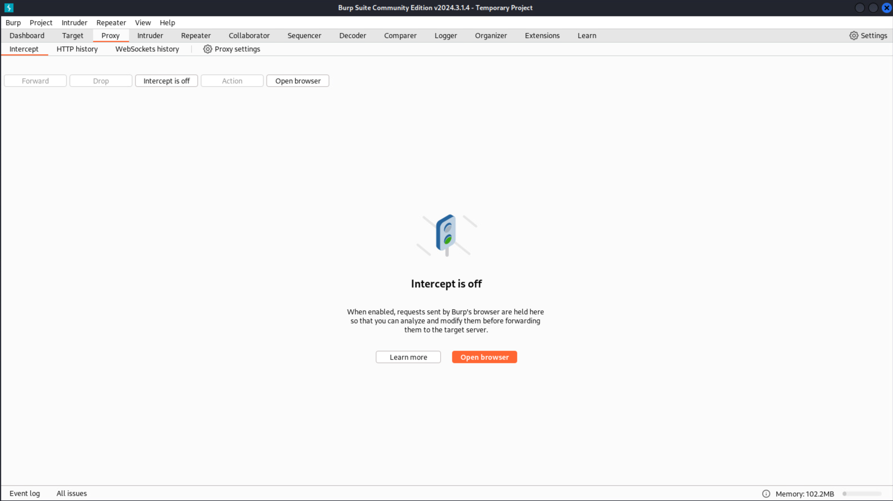

3. In Burp, select the **HTTP history** tab. In the Burp browser, browse to the **REGISTER** tab, then in the HTTP history window, select the URL for `/register.php`.

	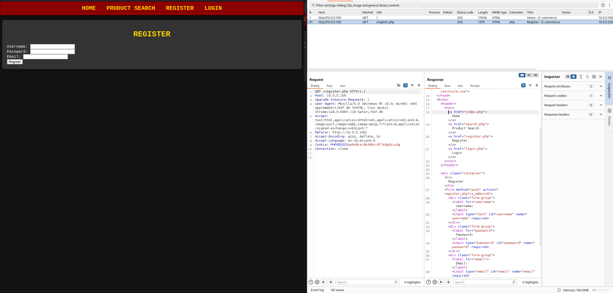

4. Create a user on the **REGISTER** tab. We used *blah* for the username and some random information for the password and email. Note the new address added to HTTP history.

	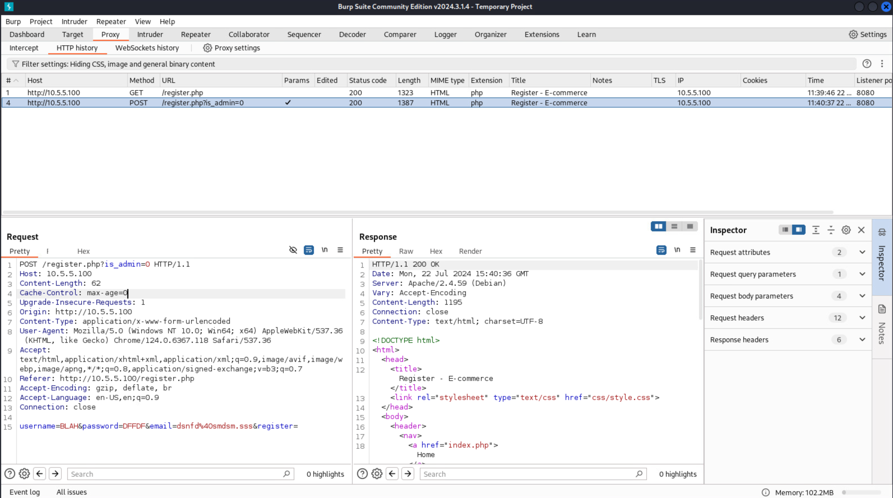

5. Right-click the left panel in Burp (**Request**) and select **Send to Repeater**. Note that the Repeater tab is highlighted. Select it. The left pane should look something like what's pictured below.

	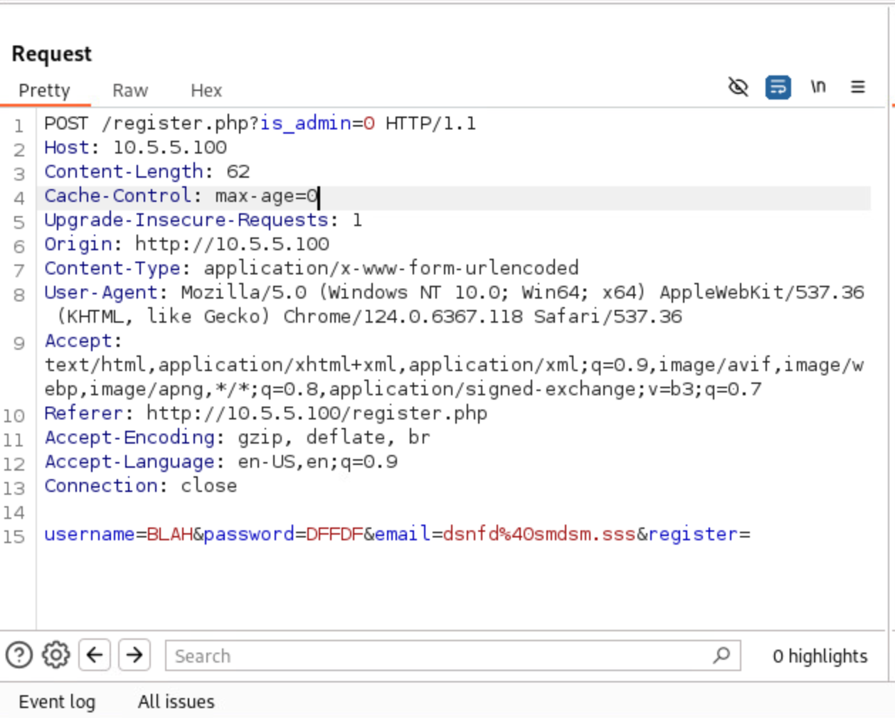

6. The very first line is sending the command with the parameter `is_admin=0`. Change that to `is_admin=1`. The last line starting with `username` is the user you attempted to register. Change them to something you'll remember such as `username=tartan&password=password` and click **Send**.

7. After clicking **Send**, the right pane populates. If you select **Render**, you will see the page indicates registration successful!

	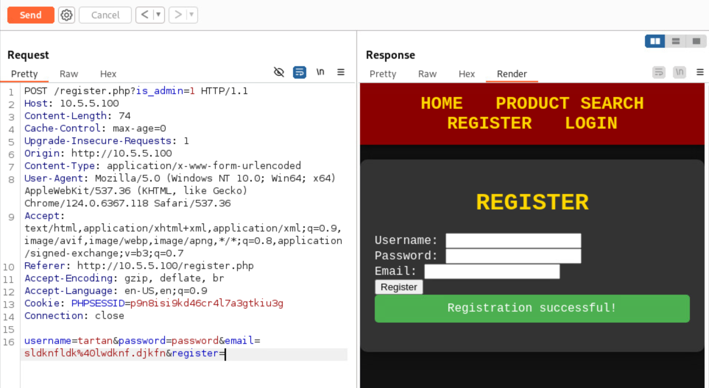

8. Return to the browser, go to the **Login** page, and log in with your newly created administrator account. You should see a welcome message and the first token.

	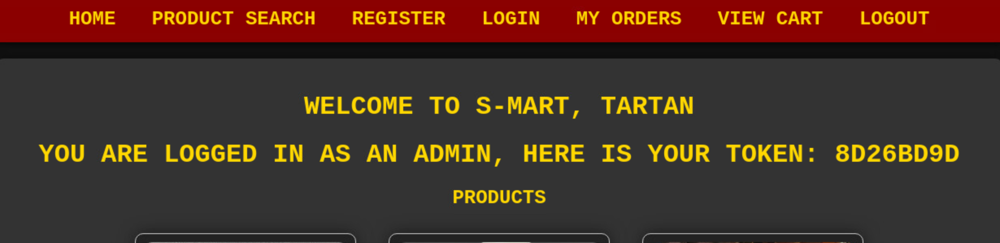

>**Note!** The tokens are randomized, so your answer will be different than what is pictured.

## Question 2

*Enter the token from bcampbell's order history.*

**Vulnerability:** Weak credentials — the user `bcampbell` has a password that can be brute-forced using the wordlist on kali.

1. Log out of any current session.

2. Attempt to log in as `bcampbell` with any password. The error message says "Invalid password." — this confirms the user exists.

   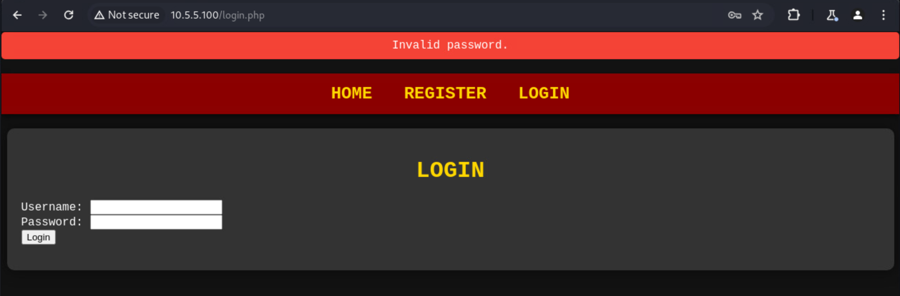

3. Use the wordlist at `/home/user/wordlist.txt` on kali.

4. Use Hydra to brute-force the login:

```bash
hydra -t 4 -l bcampbell -P /home/user/wordlist.txt shop-smart http-post-form "/login.php:username=bcampbell&password=^PASS^:Invalid password."
```

5. Hydra discovers the password is `operating`.

   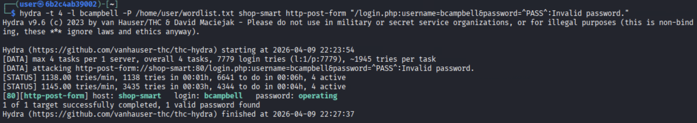

6. Log in as `bcampbell` / `operating` and navigate to **MY ORDERS**. **Token 2** is displayed on the page.

   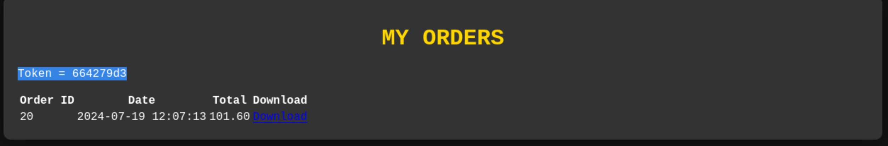

## Question 3

*Enter the value of the token3.txt file found in the /var/www/ directory.*

**Vulnerability:** Path Traversal — the `download.php` file directly uses user-supplied file paths without sanitization.

1. Log into the site with any account and click **MY ORDERS**.

2. Examine the **Download** link next to any order. The URL is: `http://shop-smart/download.php?file=invoices/order_XX.pdf`.

3. The `file` parameter is passed directly to `readfile()` without validation. Change the URL to:

```
http://shop-smart/download.php?file=/var/www/token3.txt
```

4. A file download is triggered containing **Token 3**.

## Question 4

*Enter the token for checking out with the chainsaw.*

**Vulnerability:** SQL Injection — the product search page concatenates user input directly into SQL queries.

1. Browse to the **PRODUCT SEARCH** page. Searching for `chainsaw` returns "No products found." — the chainsaw product exists in the database but is hidden (`is_visible = 0`).

2. Perform a SQL injection by entering the following into the search box:

```
' OR 1=1#
```

3. This returns all products in the database, including the hidden chainsaw.

   

4. Scroll to the bottom of the results to find the Chainsaw product.

   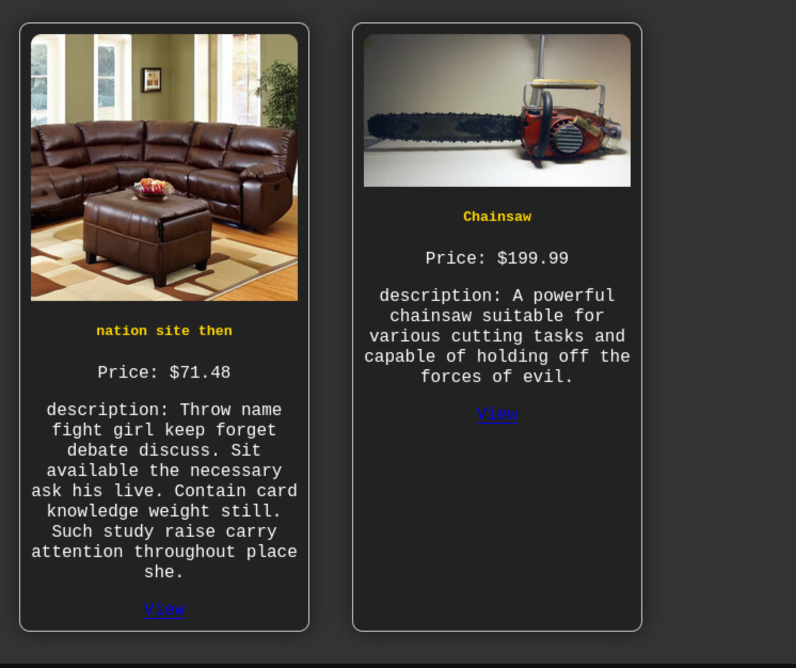

5. Click **View** on the Chainsaw product page, then click **Add to Cart**.

   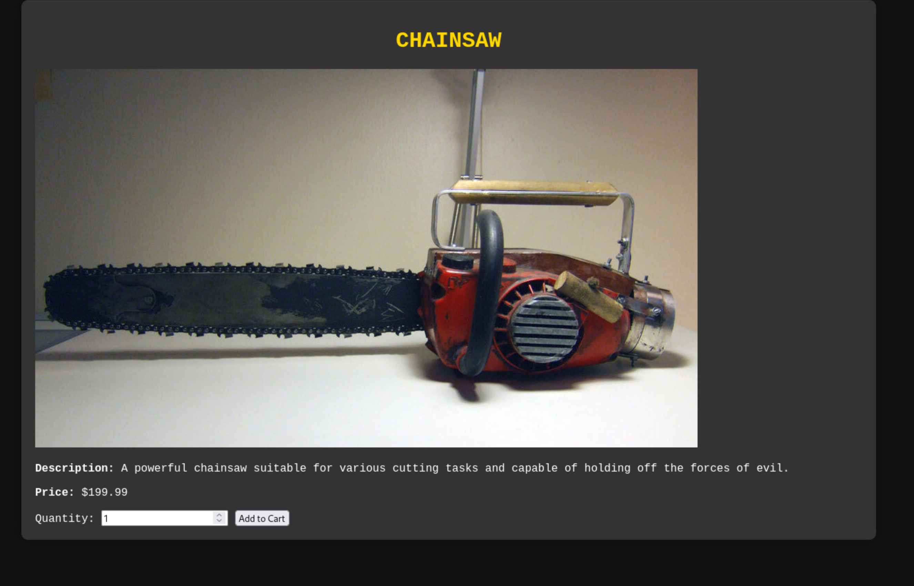

6. From the Shopping Cart, click **Proceed to Checkout**.

   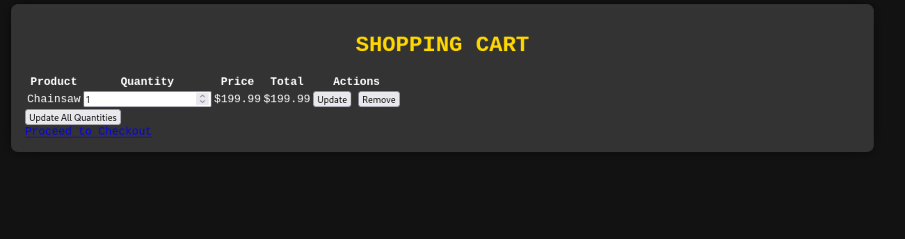

7. Click **Place Order**. The checkout page displays **Token 4** because the cart contains a hidden product.

   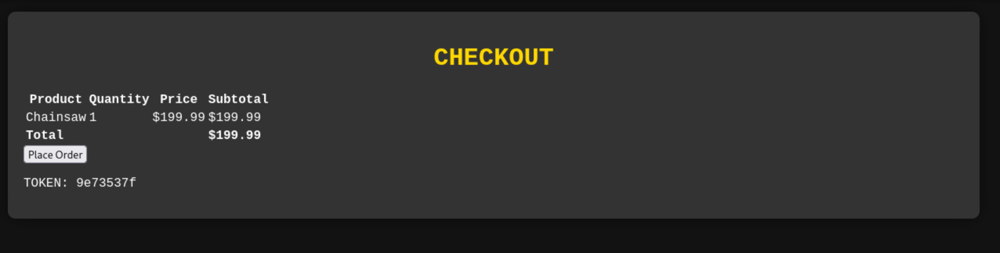
