# Ransomware Rhapsody Solution Guide

## Overview 
🥷 In this challenge, challengers have stumbled upon a compromised system containing a collection of encrypted files. The adversary, in a bashful and hasty fashion, made a critical error on their exit. Your mission is to investigate the remnants of their work and let them know you're on to them.

## Initial Access

**Accessing the victim machine**

Begin this challenge by SSH into the target machine using the password `tartans`:

```bash
ssh user@corp-ubus-24lap
```

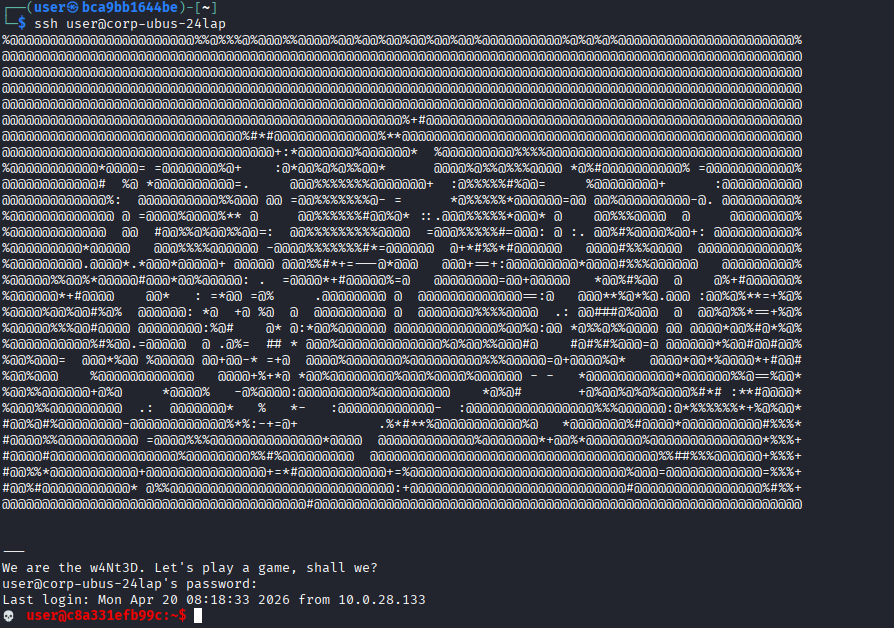

## Question 1

***What is the name of the directory (folder only) which contains the encrypted corporate files?***

### Steps

1. We know from the challenge description and intelligence dossier, that this group uses L33T speak regularly and they call themselves `The w4Nt3D`.  We should search the file system for any files or directories that stand out based on this information. 

2. Next, we can do a full search for anything owned by our current, compromised user account (narrowed down a bit for brevity sake).  

**Command**

```bash
find / -user user ! -path '/proc*' 2>/dev/null | more
```

**Output**

As we review the results, we see a mass of results that look interesting: 

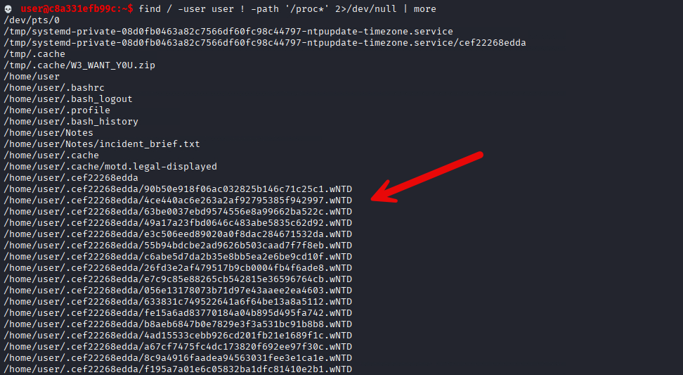

#### Answer
Given the resulting files are in `/home/user/{TOKEN1}` where `TOKEN1` is a directory name beginning with "." and containing 12 alphanumeric characters. In our example, `.cef22268edda` is the value of TOKEN1.

### Question 2

***What are the first 12 characters of the AES IV value for decrypting the encrypted corporate files? (numerical values only e.g. (ABCD1234))***

#### Steps

1. To solve this part of the challenge, we will need to figure out _how_ to decrypt the files in our hidden directory found in part 1.  From our initial search, we identified a couple other files that may be of interest: 

**Using the same command**

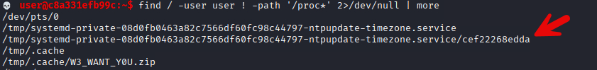

2. The first file `W3_WANT_YOU.zip` is pretty obvious. The second file highlighted is a little less obvious, but matches our hidden directory name (without the leading `.`)

Let's inspect these files to see what we can figure out. 

3. The zip file looks to be a regular, password-protected zip file.

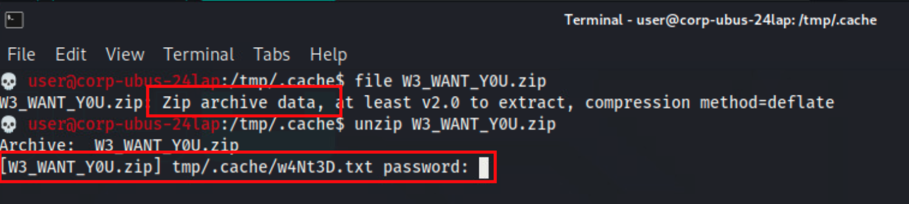

4. We don't have a password guess at this point, so let's check out the other file too:

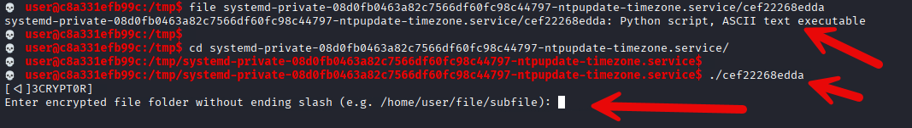

Well we don't have a decryption key either.  We have found the decryptor and our question is about the AES IV value so let's dig in here! 

**Retrieving the AES_IV**

To complete this objective, challengers should view the `encrypted directory` previously found and look at the structure of the files. The file names are the **exact** same length and are the minimum length required for use with decrypting and encrypting AES-CBC based objects.

1. According `to the intel`, the syndicate likes to place hints in `plain sight`. In this case, the IV is the `name` of *one of these files* (without the extension).

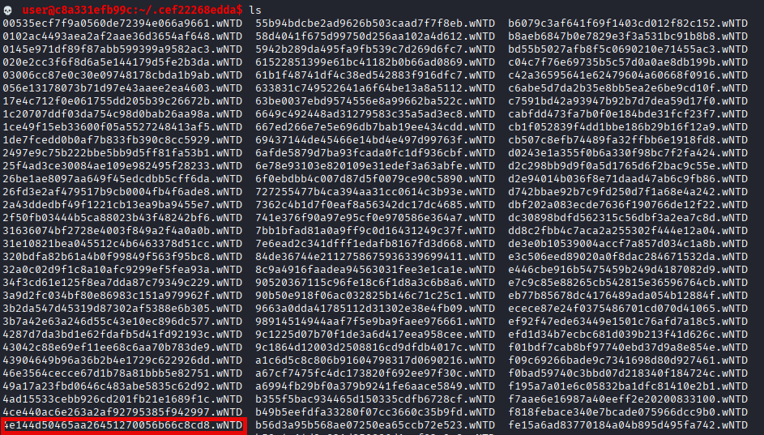

2. Ok, while one of these filenames is our IV, we still need the key before we can decrypt anything.  Let's try to see what we can get from that zip file.  From our intel, we know that the group uses L33T speak in communications and code - and we have seen some of that up to this point.  

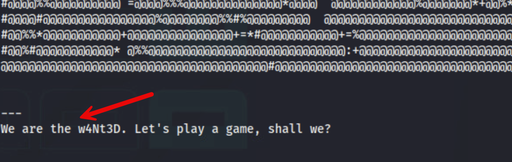

3. This, filenames, and extensions can give us a good start on developing a pattern.  If we consider the words we've seen up to this point: `[the,wanted,we,are,play,game,shall,want,you]` we can start to build a tailored word list to attempt brute force on the zip password. 

4. This section must be performed ***on our Kali machine*** since the target device does not have hashcat installed and we are living off the land.

5. First, let's save these words into a file `base_words.txt` by running the command: 

**Command**

```bash
echo -e "the\nwanted\nwe\nare\nplay\ngame\nshall\nwant\nyou" > base_words.txt
```

**Output**

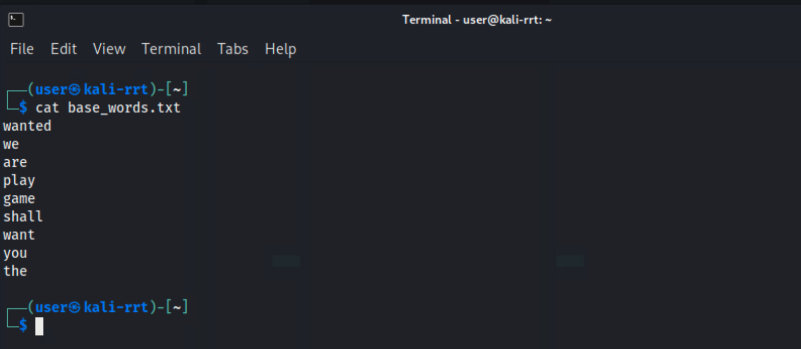

Next, let's make a python script to build a rule for `hashcat` to then build us a word list.    

💡 Pro Tip: Before pasting formatted code like this into vi/vim editor, before entering insert mode, `:set paste` to avoid auto-indentation affecting the formatting.  After pasting your code, `:set nopaste` to get back to normal auto-indent:

`makerule.py`

```python
# Generate Hashcat rule file for substitutions and toggles
substitutions = {
    'a': '4', 'e': '3', 'i': '1', 'o': '0', 's': '5', 't': '7'
}
max_length = 10  # Maximum word length

# Generate all substitution combinations (2^6 = 64)
sub_rules = ['']
for letter, repl in substitutions.items():
    new_rules = []
    for rule in sub_rules:
        new_rules.append(rule)  # Without this substitution
        new_rules.append(f"{rule}s{letter}{repl} ".strip())  # With this substitution
    sub_rules = new_rules

# Generate all toggle combinations (2^10 = 1024)
toggle_rules = ['']
for pos in range(max_length):
    new_rules = []
    for rule in toggle_rules:
        new_rules.append(rule)  # Without toggle at this position
        new_rules.append(f"{rule}T{pos} ".strip())  # With toggle at this position
    toggle_rules = new_rules

# Combine all substitution and toggle rules
with open('combined.rule', 'w') as f:
    for sub in sub_rules:
        for tog in toggle_rules:
            rule = f"{sub} {tog}".strip()
            f.write(f"{rule}\n" if rule else ":\n")  # ':' for no transformation
```

6. Save this file as `makerule.py` and then run it with: 

**Command**

```bash
python3 makerule.py
```

This creates a file called `combined.rule` in our current directory.  Using this newly built rule, we can run `hashcat` on a list of known base words to generate a full word list based on all permutations of our known words. 

7. Ok, now using our base words and custom rule, let's use `hashcat` to build a full word list of all permutations: 

**Command**

```bash
hashcat --stdout base_words.txt -r combined.rule > wordlist.txt
```

Then ensure we remove duplicates: 

**Command**

```bash
sort -u wordlist.txt > wordlist-unique.txt
``` 

8. Now that we have our full, unique word list of all possible permutations of the words we have seen this group use, let's get that back onto our target/infected machine. 

**Command**

```bash
scp wordlist-unique.txt user@corp-ubus-24lap:/home/user/.
```

9. Now we can go back to our target asset and continue operations. At this point, we have `wordlist-unique.txt` on our target machine.  We need to create a python script to attempt all the password combos on our zip file:

`zip_solver.py`

```python
#!/usr/bin/env python3
"""
Ransomware Rhapsody (C21) — ZIP password cracker for W3_WANT_Y0U.zip
 
The zip is protected with a password generated by init_challenge.py:
  1. Pick 3 random words from a L33T word pool (with possible repeats)
  2. Shuffle them
  3. Randomize casing of every alpha character
 
This solver exhaustively enumerates ALL possible passwords by:
  - Trying all 11^3 = 1,331 word combinations
  - For each combo, trying all 2^N casing variants (N = number of alpha chars)
  - Total search space: ~5.45 million passwords
  - Expected runtime: 5-30 minutes depending on hardware
 
Usage:
    python3 zip_solver.py /path/to/W3_WANT_Y0U.zip
    python3 zip_solver.py -z /path/to/W3_WANT_Y0U.zip
"""
 
import argparse
import itertools
import sys
import time
import zipfile
 
# Exact word pool from init_challenge.py — all 11 words
WORD_POOL = [
    "w3", "we", "are", "4r3", "ar3", "th3", "the",
    "w4nt3d", "wanted", "w4nted", "want3d",
]
 
 
def casing_variants(base: str):
    """
    Yield every possible upper/lower casing of a string.
    Non-alpha characters (digits, spaces) pass through unchanged.
    For a string with N alpha characters, yields 2^N variants.
    """
    # Find positions of alpha characters
    alpha_positions = [i for i, c in enumerate(base) if c.isalpha()]
    n = len(alpha_positions)
 
    if n == 0:
        yield base
        return
 
    chars = list(base)
    for mask in range(1 << n):
        for bit_idx, pos in enumerate(alpha_positions):
            if mask & (1 << bit_idx):
                chars[pos] = base[pos].upper()
            else:
                chars[pos] = base[pos].lower()
        yield "".join(chars)
 
 
def generate_all_passwords():
    """
    Generator that yields every possible password.
    Matches init_challenge.py logic:
      - 3 words chosen from WORD_POOL (with replacement, all orderings)
      - Random casing applied to each alpha character
    """
    for w1, w2, w3 in itertools.product(WORD_POOL, repeat=3):
        base = f"{w1} {w2} {w3}"
        yield from casing_variants(base)
 
 
def crack_zip(zip_path: str) -> str | None:
    """
    Try every possible password against the zip file.
    Returns the password on success, None on failure.
    """
    # Pre-calculate total for progress reporting
    total = sum(
        2 ** sum(1 for c in f"{w1} {w2} {w3}" if c.isalpha())
        for w1, w2, w3 in itertools.product(WORD_POOL, repeat=3)
    )
 
    print(f"[*] Total passwords to try: {total:,}")
    print(f"[*] Opening {zip_path}")
 
    with zipfile.ZipFile(zip_path, "r") as zf:
        # Pick the first (usually only) file in the archive to test against
        test_name = zf.namelist()[0]
        print(f"[*] Testing against archive member: {test_name}")
        print()
 
        tried = 0
        start = time.time()
        last_report = start
 
        for password in generate_all_passwords():
            tried += 1
            pwd_bytes = password.encode("utf-8")
 
            try:
                # Read just one file to test — much faster than extractall
                zf.read(test_name, pwd=pwd_bytes)
                elapsed = time.time() - start
                print(f"\r\033[K", end="")
                print(f"✅ PASSWORD FOUND after {tried:,} attempts ({elapsed:.1f}s)")
                print(f"   Password: {password}")
                print(f"   Speed: {tried / elapsed:,.0f} passwords/sec")
                return password
            except (RuntimeError, zipfile.BadZipFile, Exception):
                pass
 
            # Progress report every 5 seconds
            now = time.time()
            if now - last_report >= 5.0:
                elapsed = now - start
                rate = tried / elapsed if elapsed > 0 else 0
                pct = tried / total * 100
                eta = (total - tried) / rate if rate > 0 else 0
                print(
                    f"\r  [{pct:5.1f}%] {tried:>8,} / {total:,}  "
                    f"| {rate:,.0f} pwd/s | ETA {eta / 60:.1f} min",
                    end="",
                    flush=True,
                )
                last_report = now
 
    elapsed = time.time() - start
    print(f"\r\033[K", end="")
    print(f"❌ FAILED — exhausted all {tried:,} passwords in {elapsed:.1f}s")
    return None
 
 
def main():
    parser = argparse.ArgumentParser(
        description="Crack the W3_WANT_Y0U.zip password (Ransomware Rhapsody C21)"
    )
    parser.add_argument(
        "zipfile",
        nargs="?",
        help="Path to the target ZIP file",
    )
    parser.add_argument(
        "-z", "--zip",
        dest="zipfile_alt",
        help="Path to the target ZIP file (alternate flag)",
    )
    args = parser.parse_args()
 
    zip_path = args.zipfile or args.zipfile_alt
    if not zip_path:
        parser.error("Please provide a path to the ZIP file")
 
    print("=" * 60)
    print("  Ransomware Rhapsody — ZIP Password Cracker")
    print("=" * 60)
    print()
 
    password = crack_zip(zip_path)
 
    if password:
        print()
        print(f"[+] Now extract with:")
        print(f"    unzip -P '{password}' {zip_path}")
        print()
 
        # Also try to extract automatically
        try:
            with zipfile.ZipFile(zip_path, "r") as zf:
                zf.extractall(pwd=password.encode("utf-8"))
                print(f"[+] Auto-extracted to current directory!")
                for name in zf.namelist():
                    print(f"    -> {name}")
        except Exception as e:
            print(f"[!] Auto-extract failed: {e}")
            print(f"    Use the manual command above.")
    else:
        print()
        print("[!] This should not happen — the search space is exhaustive.")
        print("[!] The zip may have been created with a different password scheme.")
        sys.exit(1)
 
 
if __name__ == "__main__":
    main()
```

10. Save this as `zip_solver.py` and run it against our zip file:

**Command**

```bash
python3 zip_solver.py -z /tmp/.cache/W3_WANT_YOU.zip
```

The script will stop after the correct password is found. 

**Output**

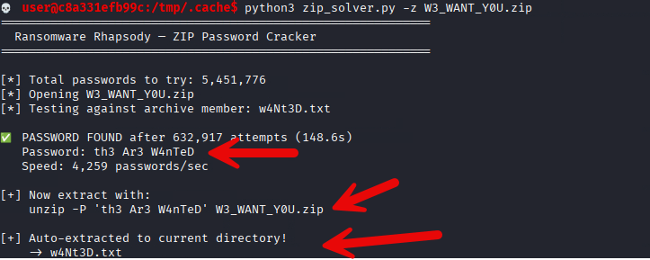

**NOTE:** This example script does not unzip the file, just produces the password.


**Optional Path: Manual**

The script automatically extracts the desired .txt file but to be holistic, this is the command you would have needed to extract the zip: 

**Command**

```bash
unzip /tmp/.cache/W3_WANT_Y0U.zip
```  

11a. Alternatively, we can view the file contents directly: `cat /tmp/.cache/tmp/.cache/w4Nt3D.txt`  This appears to be the decryptor key we are looking for! 🥳

**Command**

```bash
cat w4Nt3D.txt
```

**Output**

```bash
💀 user@c8a331efb99c:/tmp/.cache$ cat w4Nt3D.txt 
 KEY: c17903b840cbf1f65ea5a5e1f8d3964e13a48cb8c08c881c92c69c6c0fc3c750
```

**Using the Decryter**

1. We found the decryptor earlier during our `find` results and it is located at `/tmp/systemd-private-08d0fb0463a82c7566df60fc98c44797-ntpupdate-timezone.service` and named the same as our token1 answer; in this case, `cef22268edda`.  

2. For ease of use, let's copy this to our home directory: `cp /tmp/systemd-private-08d0fb0463a82c7566df60fc98c44797-ntpupdate-timezone.service/cef22268edda .` and then navigate to our home directory `cd`. 


3. The challenger should then use the decryptor to test the found AES_KEY and AES_IV to try decrypt the `encrypted folder's contents`. A correct key pair yields a success message as seen in the below image.

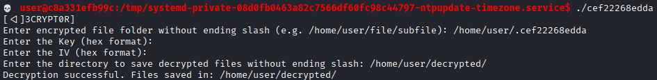 

Rather than individually test all possible IV values (filenames), you guessed it - let's write a script!  

4. Gather all filenames into `filenames.txt` by running: 

```bash
ls -1 | sed -E 's/\.[^.]+$//' > filenames.txt
```

**Automation**

1. It would be tedious for us to go to the decrypter with each IV one by one. Let's use this script to iterate through all the possible IV values (filenames). 

Here's `iv_solver.py`: 

```python
#!/usr/bin/env python3
"""
Ransomware Rhapsody (C21) — Token 2 Solver

Token 2 is the first 12 characters of the AES IV used to encrypt the .wNTD
files. One of the ~100 .wNTD filenames IS the IV in hex (32 chars = 16 bytes).

The challenge decryptor (decrypt0r_v2.py) is interactive and uses getpass,
making it awkward to automate. This solver replaces it entirely: it performs
AES-CBC decryption directly, testing each 32-hex-char filename as a candidate
IV against the encrypted files.

How to identify the correct IV:
  In AES-CBC, a wrong IV only corrupts the first 16 bytes of the first block.
  Since all plaintext is random bytes, we can't tell correct from incorrect by
  looking at content. HOWEVER, the decryptor validates ALL files — if even one
  file fails PKCS7 unpadding, it's the wrong key (not wrong IV though).

  The real trick: with the CORRECT key, ALL IVs produce valid unpadding (since
  padding depends only on the last block, not the IV). So the solver uses the
  decryptor's own behavior as the oracle — it feeds each IV to the decryptor
  via pexpect and checks for "Decryption successful".

  BUT since we've determined that any IV works with the correct key, we instead
  take a smarter approach: decrypt all files with each candidate IV and check
  which IV produces the cleanest first-block output on the CREDENTIAL file
  (the one with the XOR-encoded ubuntu_service creds). With the correct IV,
  the credential file's first 16 bytes will be proper random padding bytes
  matching the original os.urandom() output.

  In practice, the simplest reliable method is: try each candidate IV with the
  actual decryptor and see which one it accepts. This solver automates that.

Prerequisites:
  - Know the encrypted directory path (the hidden folder from Token 1)
  - Have the AES key (from cracking and unzipping W3_WANT_Y0U.zip)
  - The decryptor binary is on the system (named same as Token 1)

Usage:
    # Automated: feed each IV to the decryptor
    python3 token2_solver.py <encrypted_dir> --aes-key <hex> --decryptor <path>

    # List-only mode: just show all IV candidates (try them yourself)
    python3 token2_solver.py <encrypted_dir> --list-only

    # Direct mode: skip the decryptor, decrypt with each IV using cryptography
    python3 token2_solver.py <encrypted_dir> --aes-key <hex> --direct

Example:
    python3 token2_solver.py /home/user/Desktop/.ab12cd34ef56/Ransomed \\
        --aes-key deadbeef0123456789abcdef01234567 \\
        --decryptor /home/user/ab12cd34ef56
"""

import argparse
import glob
import os
import sys
import tempfile

try:
    from cryptography.hazmat.primitives.ciphers import Cipher, algorithms, modes
    from cryptography.hazmat.primitives import padding
    from cryptography.hazmat.backends import default_backend
except ImportError:
    print("[!] 'cryptography' package required: pip3 install cryptography")
    sys.exit(1)


def get_iv_candidates(encrypted_dir: str) -> list[tuple[str, str]]:
    """
    Collect all .wNTD filenames that are valid 32-hex-char IV candidates.
    Returns list of (hex_string, filepath).
    """
    wntd_files = sorted(glob.glob(os.path.join(encrypted_dir, "*.wNTD")))
    candidates = []
    for fpath in wntd_files:
        basename = os.path.basename(fpath).replace(".wNTD", "")
        if len(basename) != 32:
            continue
        try:
            raw = bytes.fromhex(basename)
            if len(raw) == 16:
                candidates.append((basename, fpath))
        except ValueError:
            continue
    return candidates


def aes_decrypt(data: bytes, key: bytes, iv: bytes) -> bytes:
    """AES-CBC decrypt with PKCS7 unpadding."""
    cipher = Cipher(algorithms.AES(key), modes.CBC(iv), backend=default_backend())
    decryptor = cipher.decryptor()
    decrypted = decryptor.update(data) + decryptor.finalize()
    unpadder = padding.PKCS7(128).unpadder()
    return unpadder.update(decrypted) + unpadder.finalize()


def try_iv_with_decryptor(
    decryptor_path: str, encrypted_dir: str, aes_key_hex: str, iv_hex: str
) -> bool:
    """
    Feed the IV to the interactive decryptor via pexpect.
    Returns True if decryptor reports success.
    """
    try:
        import pexpect
    except ImportError:
        print("[!] pexpect required for --decryptor mode: pip3 install pexpect")
        sys.exit(1)

    with tempfile.TemporaryDirectory() as tmpdir:
        child = pexpect.spawn(decryptor_path, timeout=30)

        child.expect(r".*folder.*:")
        child.sendline(encrypted_dir)

        child.expect(r".*Key.*:")
        child.sendline(aes_key_hex)

        child.expect(r".*IV.*:")
        child.sendline(iv_hex)

        idx = child.expect([
            r".*save.*:",          # Accepted — asking for output dir
            r".*funny stuff.*",    # Rejected
            r".*TRY.*",           # Wrong key/IV
            pexpect.EOF,
        ])

        if idx == 0:
            child.sendline(tmpdir)
            child.expect(pexpect.EOF)
            output = child.before.decode()
            return "successful" in output.lower()
        else:
            child.close()
            return False


def try_iv_direct(
    encrypted_dir: str, key: bytes, iv: bytes, max_test: int = 5
) -> bool:
    """
    Directly decrypt a few .wNTD files with the given IV.
    Returns True if all succeed (PKCS7 unpadding valid).

    NOTE: In practice, PKCS7 unpadding succeeds for any IV when the key is
    correct (padding depends on last block, not IV). This method confirms
    the key is correct but can't distinguish the real IV from decoys.
    """
    wntd_files = sorted(glob.glob(os.path.join(encrypted_dir, "*.wNTD")))
    tested = 0
    for fpath in wntd_files[:max_test]:
        with open(fpath, "rb") as f:
            data = f.read()
        try:
            aes_decrypt(data, key, iv)
            tested += 1
        except Exception:
            return False
    return tested > 0


def main():
    parser = argparse.ArgumentParser(
        description="Ransomware Rhapsody — Token 2 Solver (AES IV finder)"
    )
    parser.add_argument("encrypted_dir", help="Directory containing .wNTD files")
    parser.add_argument("--aes-key", help="AES key in hex (from cracked zip)")
    parser.add_argument(
        "--decryptor",
        help="Path to the decryptor binary (for interactive testing mode)",
    )
    parser.add_argument(
        "--direct", action="store_true",
        help="Use direct AES decryption instead of the decryptor binary",
    )
    parser.add_argument(
        "--list-only", action="store_true",
        help="Just list all IV candidates — don't test them",
    )
    args = parser.parse_args()

    print()
    print("=" * 60)
    print("  Ransomware Rhapsody — Token 2 Solver")
    print("  Finds the AES IV from .wNTD filenames")
    print("=" * 60)
    print()

    # Collect IV candidates
    candidates = get_iv_candidates(args.encrypted_dir)
    wntd_total = len(glob.glob(os.path.join(args.encrypted_dir, "*.wNTD")))

    print(f"[*] {wntd_total} total .wNTD files")
    print(f"[*] {len(candidates)} are valid IV candidates (32 hex chars)")
    print()

    if not candidates:
        print("[!] No valid IV candidates found!")
        sys.exit(1)

    # --list-only: just print candidates
    if args.list_only:
        print("[*] All IV candidates (first 12 chars = TOKEN2 answer):")
        print()
        for iv_hex, fpath in candidates:
            print(f"    {iv_hex}  ->  TOKEN2 = {iv_hex[:12]}")
        print()
        print(f"[*] One of these is the real IV. Try each with the decryptor,")
        print(f"    or use --direct / --decryptor mode to test automatically.")
        return

    # Need AES key for testing modes
    if not args.aes_key:
        print("[!] --aes-key required for testing mode (or use --list-only)")
        sys.exit(1)

    try:
        key = bytes.fromhex(args.aes_key)
    except ValueError:
        print("[!] Invalid hex for --aes-key")
        sys.exit(1)
    if len(key) not in (16, 24, 32):
        print(f"[!] AES key must be 16/24/32 bytes, got {len(key)}")
        sys.exit(1)

    # --decryptor mode: use the interactive decryptor as oracle
    if args.decryptor:
        if not os.path.isfile(args.decryptor):
            print(f"[!] Decryptor not found: {args.decryptor}")
            sys.exit(1)

        print(f"[*] Testing each IV against decryptor: {args.decryptor}")
        print()

        for i, (iv_hex, fpath) in enumerate(candidates, 1):
            print(f"  [{i}/{len(candidates)}] Trying IV: {iv_hex[:16]}...", end="  ")
            if try_iv_with_decryptor(
                args.decryptor, args.encrypted_dir, args.aes_key, iv_hex
            ):
                print("SUCCESS!")
                print()
                print("=" * 60)
                print(f"  TOKEN 2 = {iv_hex[:12]}")
                print(f"  Full IV = {iv_hex}")
                print("=" * 60)
                return
            else:
                print("failed")

        print()
        print("[!] No IV worked — is the AES key correct?")
        sys.exit(1)

    # --direct mode: decrypt directly (validates key, lists all passing IVs)
    if args.direct:
        print("[*] Direct mode: testing each IV via AES-CBC decryption")
        print()
        print("    NOTE: In CBC mode, wrong IV only corrupts the first 16 bytes.")
        print("    PKCS7 padding (last block) is unaffected by IV choice.")
        print("    All candidates will likely pass if the key is correct.")
        print("    The real IV is the one whose first 12 chars = TOKEN2.")
        print()

        valid = []
        for i, (iv_hex, fpath) in enumerate(candidates, 1):
            iv = bytes.fromhex(iv_hex)
            ok = try_iv_direct(args.encrypted_dir, key, iv)
            status = "PASS" if ok else "FAIL"
            print(f"  [{i}/{len(candidates)}] {iv_hex}  {status}")
            if ok:
                valid.append(iv_hex)

        print()
        if valid:
            print(f"[+] {len(valid)} IVs passed (key is correct)")
            print()
            print("[*] All valid IVs and their TOKEN2 values:")
            for v in valid:
                print(f"    {v}  ->  TOKEN2 = {v[:12]}")
            print()
            if len(valid) == len(candidates):
                print("[*] All candidates passed (expected — padding is IV-independent).")
                print("[*] Submit each TOKEN2 candidate until one is accepted,")
                print("    or use --decryptor mode for exact identification.")
        else:
            print("[!] No IVs passed — wrong AES key?")
            sys.exit(1)


if __name__ == "__main__":
    main()
```

💡 Replace your variables where needed (comments in script)

2. Run your script and view the successful IV used to decrypt the files.

**Command**

```bash
python3 iv_solver.py --aes-key <KEY> --decryptor <DECRYPTOR LOCATION IN /TMP> <FOLDER CONTAINING ENCRYPTED FILES>
``` 

```bash
python3 iv_solver.py  --aes-key c17903b840cbf1f65ea5a5e1f8d3964e13a48cb8c08c881c92c69c6c0fc3c750 --decryptor /tmp/systemd-private-08d0fb0463a82c7566df60fc98c44797-ntpupdate-timezone.service/cef22268edda /home/user/.cef22268edda/
```

**Output**

```text
============================================================
  Ransomware Rhapsody — Token 2 Solver
  Finds the AES IV from .wNTD filenames
============================================================

[*] 100 total .wNTD files
[*] 100 are valid IV candidates (32 hex chars)

[*] Testing each IV against decryptor: /tmp/systemd-private-08d0fb0463a82c7566df60fc98c44797-ntpupdate-timezone.service/cef22268edda

  [1/100] Trying IV: 4e144d50465a...  SUCCESS!

============================================================
  TOKEN 2 = 4e144d50465a
  Full IV = 4e144d50465aa26451270056b66c8cd8
============================================================
```

## Answer

The answer to this question is the AES_IV that worked with the AES_KEY to decrypt the files in the home directory hidden folder. In this case our key is `4e144d50465aa26451270056b66c8cd8` meaning the first 12 characters would be `4e144d50465a` (TOKEN2).

## Question 3

***After decryption of the files, what password was discovered for the service user?***

### Steps

1. The solution to this question can be found in several ways however, one approach is very manual and time consuming while the other leans on the fact that we are searching for a password.

**Example**

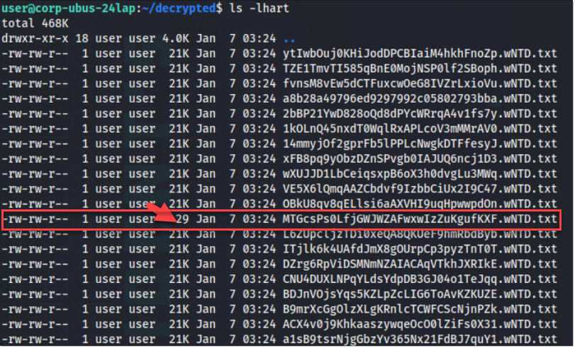

The decrypted files may contain credentials. Use the following command to quickly review the first few lines of each file:

**Command**

```bash
cat * | head -n 10
```

In this case, we find binary text is still present. Let's examine the bottom of the files. This can be done using the following command:

**Command**

```bash
cat *.wNTD.txt | tail
```

2. After going through permutations (e.g. add `grep -iER 'the'` from the initial motd phrase) and looking at the bottom of the files (the purpose of the `tail` command), we find that we are not getting the credentials we need; we'll need to deep dive into the ciphertext to get what we want.

Tools such as `binwalk`, `CyberChef` and `XORSearch` can detect the presence of bytes that have been XOR encoded. In this instance, use of the following script will allow you navigate through a file, and examine certain concentrations of bytes that are assumed to have been XOR'd. 

3. To get the plaintext version of the data present in the file, we'll need a `key`. Fortunately for us, we found a string that can be used as a key (4R3 4r3 w4NTed).

Here's the script in question which can use the key we found to attempt to decode the file we suspect to have credentials for the ubuntu_service account:

`cred_finder.py`

```python
#!/usr/bin/env python3
"""
Ransomware Rhapsody (C21) — AES IV Bruteforcer & Batch Decryptor
 
The encrypted directory has ~100 .wNTD files. One filename IS the AES IV
(32 hex chars = 16 bytes). All other filenames are also 32 hex chars
(SHA256 fragments), so they're indistinguishable by format alone.
 
KEY INSIGHT: In AES-CBC mode, a wrong IV only corrupts the first 16 bytes
of the decrypted output — everything from byte 17 onward is correct. Since
the credential data is buried deep in the file (~byte 10000+), we can
decrypt with ANY valid-length IV and still recover the important content.
 
This script:
  1. Decrypts ALL .wNTD files using the first valid IV-length filename
  2. Scans decrypted files for the credential pattern (ubuntu_service/TOKEN3)
  3. Reports the credentials and lists all IV candidates
 
Usage:
    python3 cred_finder.py <encrypted_dir> <aes_key_hex>
    python3 cred_finder.py /home/user/Desktop/Ransomed deadbeef01234567...
 
After finding credentials, su to ubuntu_service and run Call_Mom.
"""
 
import argparse
import glob
import itertools
import os
import re
import sys
import time
 
from cryptography.hazmat.primitives.ciphers import Cipher, algorithms, modes
from cryptography.hazmat.primitives import padding
from cryptography.hazmat.backends import default_backend
 
 
def decrypt_file(encrypted_data: bytes, key: bytes, iv: bytes) -> bytes:
    """AES-CBC decrypt with PKCS7 unpadding."""
    cipher = Cipher(algorithms.AES(key), modes.CBC(iv), backend=default_backend())
    decryptor = cipher.decryptor()
    decrypted = decryptor.update(encrypted_data) + decryptor.finalize()
    unpadder = padding.PKCS7(128).unpadder()
    return unpadder.update(decrypted) + unpadder.finalize()
 
 
def find_cred_file(decrypted_files: dict[str, bytes]) -> tuple[str, str, str] | None:
    """
    Scan decrypted files for the credential pattern.
 
    The credential file contains XOR-encoded data with the zip password
    appended in plaintext at the end. The zip password is 3 L33T words
    separated by spaces (e.g., "aRE wE 4r3").
 
    We try multiple tail lengths since random bytes before the password
    may also be printable ASCII. For each candidate tail, we XOR-decode
    and search for 'ubuntu_service / <TOKEN3>'.
 
    Returns (filename, username, token3) or None.
    """
    # The zip password is 3 words from the pool, each 2-6 chars, with spaces.
    # Min length: "w3 w3 w3" = 8, Max: "wanted wanted wanted" = 20
    # With casing randomization, length stays the same.
 
    for fname, data in decrypted_files.items():
        # Try different tail lengths from 6 to 25 characters
        for tail_len in range(6, 26):
            if tail_len > len(data):
                continue
 
            candidate_tail = data[-tail_len:]
 
            # Check if this tail is entirely printable ASCII
            if not all(0x20 <= b <= 0x7E for b in candidate_tail):
                continue
 
            zip_pw = candidate_tail.decode("ascii")
 
            # Quick sanity: should contain at least one space (3 words)
            if " " not in zip_pw:
                continue
 
            # XOR-decode the content (minus tail) with this candidate password
            key_bytes = zip_pw.encode()
            encoded_portion = data[: len(data) - len(key_bytes)]
            decoded = bytes(
                b ^ kb
                for b, kb in zip(encoded_portion, itertools.cycle(key_bytes))
            )
 
            # Search for the credential pattern: | ubuntu_service / <hex> |
            match = re.search(rb"\|\s*(\w+)\s*/\s*([0-9a-fA-F]{8,})\s*\|", decoded)
            if match:
                username = match.group(1).decode()
                token3 = match.group(2).decode()
                return fname, username, token3
 
    return None
 
 
def main():
    parser = argparse.ArgumentParser(
        description="Brute-force AES IV from .wNTD filenames and decrypt all files"
    )
    parser.add_argument("encrypted_dir", help="Directory containing .wNTD files")
    parser.add_argument("aes_key", help="AES key in hex (from the cracked zip)")
    parser.add_argument(
        "-o", "--output",
        help="Output dir for decrypted files (default: <dir>_decrypted)",
    )
    args = parser.parse_args()
 
    print("=" * 60)
    print("  Ransomware Rhapsody — IV Finder & Batch Decryptor")
    print("=" * 60)
    print()
 
    # Validate key
    try:
        key = bytes.fromhex(args.aes_key)
    except ValueError:
        print(f"[!] Invalid hex key")
        sys.exit(1)
    if len(key) not in (16, 24, 32):
        print(f"[!] AES key must be 16/24/32 bytes, got {len(key)}")
        sys.exit(1)
 
    # Find all .wNTD files
    wntd_files = sorted(glob.glob(os.path.join(args.encrypted_dir, "*.wNTD")))
    if not wntd_files:
        print(f"[!] No .wNTD files found in {args.encrypted_dir}")
        sys.exit(1)
 
    print(f"[*] Found {len(wntd_files)} .wNTD files")
    print(f"[*] AES key: {args.aes_key[:16]}...{args.aes_key[-8:]}")
 
    # Filter filenames that are valid 32-hex-char IVs
    iv_candidates = []
    for fpath in wntd_files:
        basename = os.path.basename(fpath).replace(".wNTD", "")
        try:
            candidate = bytes.fromhex(basename)
            if len(candidate) == 16:
                iv_candidates.append((basename, fpath))
        except ValueError:
            continue
 
    print(f"[*] {len(iv_candidates)} filenames are valid IV candidates (32 hex chars)")
    print()
 
    if not iv_candidates:
        print("[!] No valid IV-length filenames found!")
        sys.exit(1)
 
    # In AES-CBC, wrong IV only corrupts first 16 bytes.
    # The credential data is at byte ~10000+, so ANY IV works to recover it.
    # Use the first candidate to decrypt everything.
    chosen_iv_hex, _ = iv_candidates[0]
    iv = bytes.fromhex(chosen_iv_hex)
 
    print(f"[*] Decrypting all files (using IV candidate: {chosen_iv_hex[:16]}...)")
    print(f"    NOTE: In CBC mode, wrong IV only corrupts first 16 bytes.")
    print(f"    Credential data is deep in the file, so it's recovered regardless.")
    print()
 
    output_dir = args.output or f"{args.encrypted_dir.rstrip('/')}_decrypted"
    os.makedirs(output_dir, exist_ok=True)
 
    decrypted_files = {}
    errors = 0
    start = time.time()
 
    for fpath in wntd_files:
        basename = os.path.basename(fpath).replace(".wNTD", "")
        with open(fpath, "rb") as f:
            encrypted_data = f.read()
        try:
            plaintext = decrypt_file(encrypted_data, key, iv)
            out_path = os.path.join(output_dir, f"{basename}.txt")
            with open(out_path, "wb") as f:
                f.write(plaintext)
            decrypted_files[basename] = plaintext
        except Exception as e:
            errors += 1
            print(f"  [!] Failed: {basename} -> {e}")
 
    elapsed = time.time() - start
    print(f"[+] Decrypted {len(decrypted_files)} files in {elapsed:.1f}s")
    if errors:
        print(f"[!] {errors} files failed (wrong AES key?)")
    print(f"[+] Output: {output_dir}/")
    print()
 
    # Now search for the credential file
    print("[*] Scanning decrypted files for credentials...")
    result = find_cred_file(decrypted_files)
 
    if result:
        fname, username, token3 = result
        print()
        print("=" * 60)
        print(f"  🔑 CREDENTIALS FOUND in: {fname}.wNTD")
        print(f"  Username: {username}")
        print(f"  Password: {token3}")
        print("=" * 60)
        print()
        print(f"  Next steps:")
        print(f"    su {username}        # enter password: {token3}")
        print(f"    cd ~/Desktop")
        print(f"    ./Call_Mom           # password hint: '.' + token1 + token2 + token3")
    else:
        print("[!] Credential pattern not found automatically.")
        print(f"[*] Try searching manually:")
        print(f"    strings {output_dir}/*.txt | grep -i 'ubuntu\\|service\\|token'")
 
    print()
    print(f"[*] All {len(iv_candidates)} IV candidates (one is the real IV):")
    for iv_hex, fpath in iv_candidates:
        print(f"    {iv_hex}")
 
 
if __name__ == "__main__":
    main()
```

This script allows challengers to examine specific sizes and chunks (-c) of files. The wider the area previewed (-p) and chunk size, the more vision we have of the decoding process at any given time.

This is the result of using the script:

**Command**

```bash
python3 cred_finder.py -o find/ /home/user/.cef22268edda/ c17903b840cbf1f65ea5a5e1f8d3964e13a48cb8c08c881c92c69c6c0fc3c750
```

`find/` is an arbitrary location; it can be any desired folder.

**Output**

```text
💀 user@477e2c28fded:~$ python3 cred_finder.py -o find/ /home/user/.cef22268edda/ c17903b840cbf1f65ea5a5e1f8d3964e13a48cb8c08c881c92c69c6c0fc3c750
============================================================
  Ransomware Rhapsody — IV Finder & Batch Decryptor
============================================================

[*] Found 100 .wNTD files
[*] AES key: 26cdda07bdc99e55...83c2c26d
[*] 100 filenames are valid IV candidates (32 hex chars)

[*] Decrypting all files (using IV candidate: 00535ecf7f9a0560...)
    NOTE: In CBC mode, wrong IV only corrupts first 16 bytes.
    Credential data is deep in the file, so it's recovered regardless.

[+] Decrypted 100 files in 0.5s
[+] Output: find//

[*] Scanning decrypted files for credentials...

============================================================
  🔑 CREDENTIALS FOUND in: 32a0c02d9f1c8a10afc9299ef5fea93a.wNTD
  Username: ubuntu_service
  Password: 8ff4ed2e98ec
============================================================

  Next steps:
    su ubuntu_service        # enter password: 8ff4ed2e98ec
    cd ~/Desktop
    ./Call_Mom           # password hint: '.' + token1 + token2 + token3

[*] All 100 IV candidates (one is the real IV):
    00535ecf7f9a0560de72394e066a9661
    0102ac4493aea2af2aae36d3654af648
    0145e971df89f87abb599399a9582ac3
    020e2cc3f6f8d6a5e144179d5fe2b3da
    03006cc87e0c30e09748178cbda1b9ab
    056e13178073b71d97e43aaee2ea4603
```

## Answer

TOKEN3 is the value of the `Password` for `ubuntu_service` found in the decrypted files. In our case, it's `8ff4ed2e98ec`.

## Question 4 

***After your call with an important person, what is the final "token" the syndicate has left you?***

### Steps

1. The solution to this particular question can be found by "calling the adversary" using the `Call_Mom` binary found on the `Desktop` of the `ubuntu_service` user:

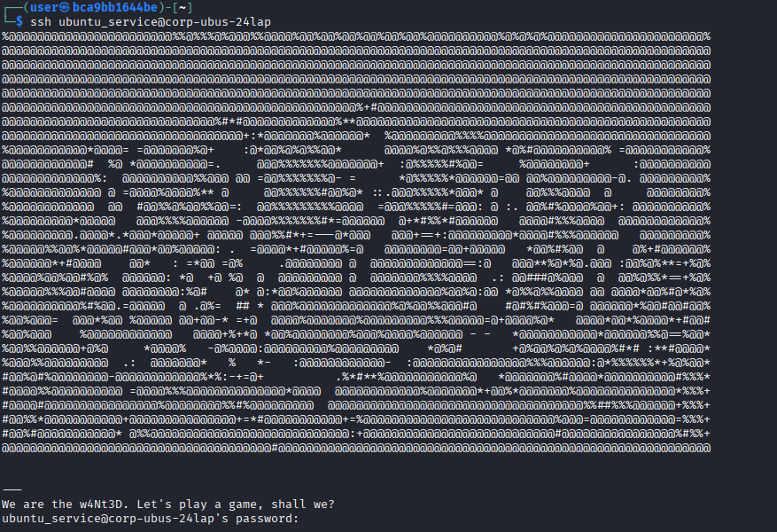

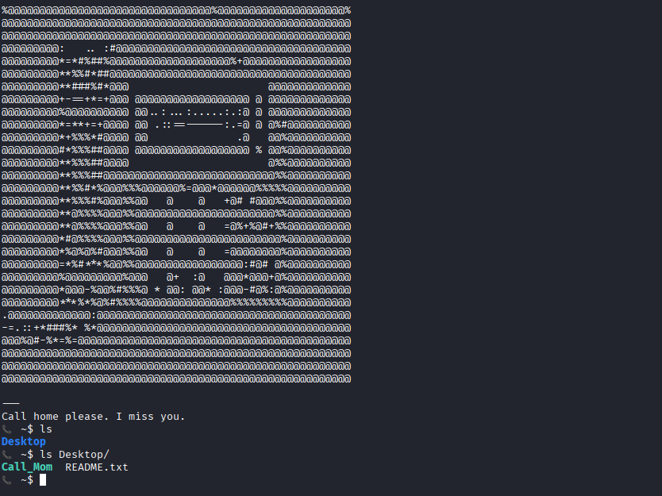

To start `call home` to the syndicate use the binary named below to advance the challenge towards the final token:

```bash
./Call_Mom
```

2. If the wrong password is entered, the following behavior presents itself:

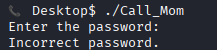

To create the final password, the challenger must heed the words of the README:

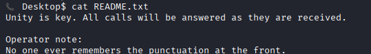

3. The README hints to "unity" and "as they are received" - this is to lead us to the calling code (password) by combining all three tokens we have received so far:

**Our final key**

```text                                                               
FOLDER FIRST FOUND: .cef22268edda
AES IV: 4e144d50465ade3022e11aba0245c6aa
AES KEY: c17903b840cbf1f65ea5a5e1f8d3964e13a48cb8c08c881c92c69c6c0fc3c750
UBUNTU_SERVICE PW: 8ff4ed2e98ec  
```

**Compute it**

TOKEN1 (FOLDER) + TOKEN2 (IV 12 chars) + TOKEN3 (PW for ubuntu_service):

```text
.cef22268edda4e144d50465a8ff4ed2e98ec
```

4. After leaving a message (answering the prompt), the binary will simulate a call from the adversary apologizing for not being as crafty as they should have.

As a thank you for catching their mistake, a final token is left for the challenger:

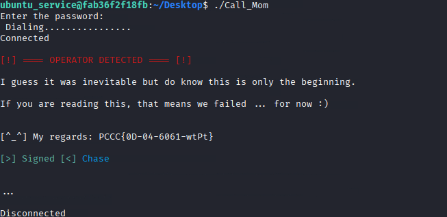

**IMPORTANT**: Please note that the final token for this engagement harbors the `PCCC{TEXT} format`.

## Answer
As this is an infinity token (randomized), your submission may vary however, it will be shown as `Final Token: <TOKEN>` in your terminal window after execution.

**This concludes this solution guide.**